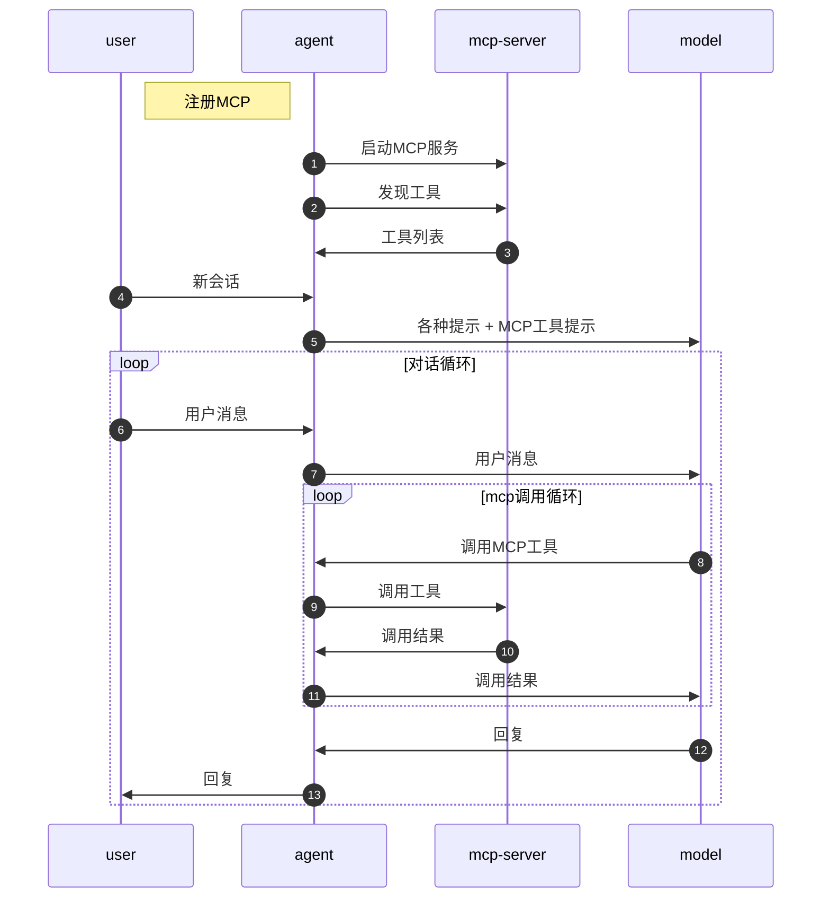
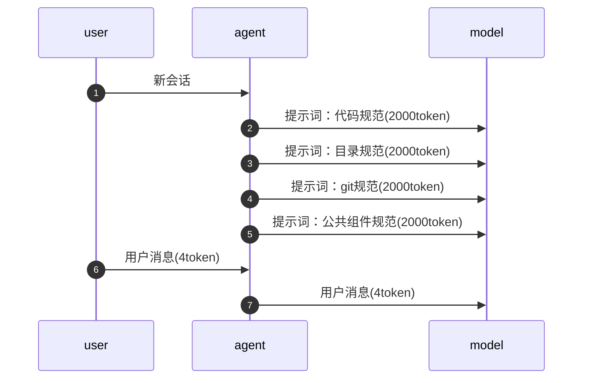
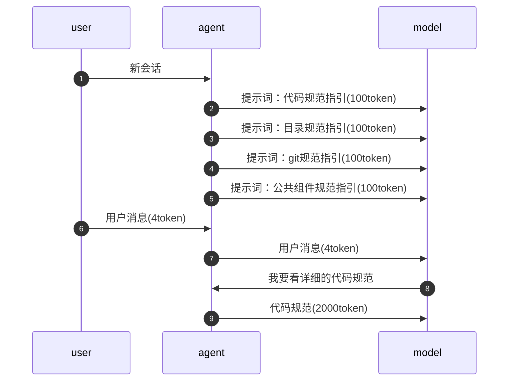

# AI效能工具

AI编程（可控性）

1. 技术认知：最核心
2. 范式：工具无关
3. 工具使用：概念

## 工具使用

### 工具选择

IDE + Coding Agent + 模型

1. IDE集成：VSCode、Cursor、Trae、....
2. IDE + Coding Agent + 模型：
   - Coding Agent：`Claude Code`、`Codex`、`OpenCode`、....
   - 模型：`Claude Sonnet`、`Claude Opus`、`Codex`、`Gemini`、`Kimi`、`GLM`、`Minimax`、...

### Coding Agent原理

#### tools

```shell
总结一下这个项目在干什么 ---> 大模型 ---> ????
```

Coding Agent

1. 加提示词
   - 告诉大模型，目前项目代码的路径
   - 告诉大模型，可以使用哪些工具
2. 将用户问题和提示词一起传递给大模型
3. 大模型根据情况决定是否要使用工具。当需要使用工具的时候，它会返回一个JSON格式
4. Agent, 它就会拿到这个JSON格式，然后根据JSON格式的内容决定接下来如何处理?
5. Agent将执行的结果，然后返回给模型，又输入给大模型
6. 后续呢，继续交互性的操作，就大模型跟Agent之间不停的交互，直到得得到一个最终的答案

常用工具：

- command
- read
- write
- delete

#### 会话

conversation / session / thread

在同一个会话里边，每一次用户发消息都要把之前的所有历史消息内容全部带上

#### 提示词

全局提示词、工程提示词

全局提示词是没开启一次会话必须要知道的内容，大部分情况下不要也行。

工程提示词:工程提示词一般都是对整个项目的描述，让发给模型的时候，模型可以快速的了解项目信息，避免模型自动的去寻找，从而产生大量的上下文。

> 全局/项目提示词，包括之后的skills等东西核心目的都是为了简化上下文，因为对于大模型来说，上下文越多就越容易产生幻觉。

#### 深度思考/推理/思维链

用户问题 ---> 模型 ---> 回复

用户问题 ---> 模型 ---> 思考过程(把用户问题+思考过程再次发送给) ---> 模型 ---> 确定性更高的回复

#### MCP

可以简单的理解为：MCP就是一个tool的集合

agent和MCP之间建立起交互。
在每次会话里:
用户问题(agent提示词+Tools+MCP) -->模型(调用工具申请) -->agent(调用工具结果发送)-->模型(决定是否完成)-->agent-->用户



> MCP是25年的概念，存在一些问题，现在逐渐开始淡化MCP概念。

#### Skill
Skill最初要解决的问题是提示词过大的问题。它第一次引入了**渐进式**提示方案。

> 渐进式思想要烙在脑子里

**无渐进式方案：**



**渐进式方案：**



skill商店：https://skills.sh/

**skill和MCP的区别:**

- MCP是一个外挂程序，在最开始的时候，agent就需要把MCP及所有的技能描述都告诉模型，会导致上下文过大。
- Skill主要是渐进式思想，最开始由agent把缩略描述告诉模型，模型决定是否使用，如果使用就由agent发送详细的信息供模型调用，但是调用不是一次性的。

> 现在claude提出一个 claude cli的工具思想,也是渐进式的，以后可能会取代MCP。

#### Sub Agent

子代理拥有独立的：提示词、会话上下文[、skills、tools、权限边界...]

子代理的优势：

- 独立会话，不污染主代理上下文
- 可并行执行，缩短任务总时长
- 能力专注，更适合专项任务

Coding Agent一般会有两种形式的子代理：

- 内置子代理：系统内置的代理，不同厂商设置不同，用户无法干预
- 用户子代理：用户启动的子代理，通常用于完成各种并行、独立的开发任务，需要用户用提示词启动

#### 长期记忆

Coding Agent 有内置的长期记忆系统，会记录和用户的沟通过程中沉淀的经验和教训。

### 开发范式

vibe coding: 氛围编程

spec coding：SDD, Spec-driven development 规范驱动开发

> spec coding 是一个过渡产物

- Spec-kit
- OpenSpec
- SuperPowers

## 最佳实践

1. 每一个会话应该保持独立和连续。（尽量减少会话中的内容）
1. 提示词始终保持精简
1. 文档尽量的细粒度拆分
1. skill数量不宜超过12个
1. 独立、并行任务适合使用子代理完成
1. 奖罚分明，有利于形成长期记忆
