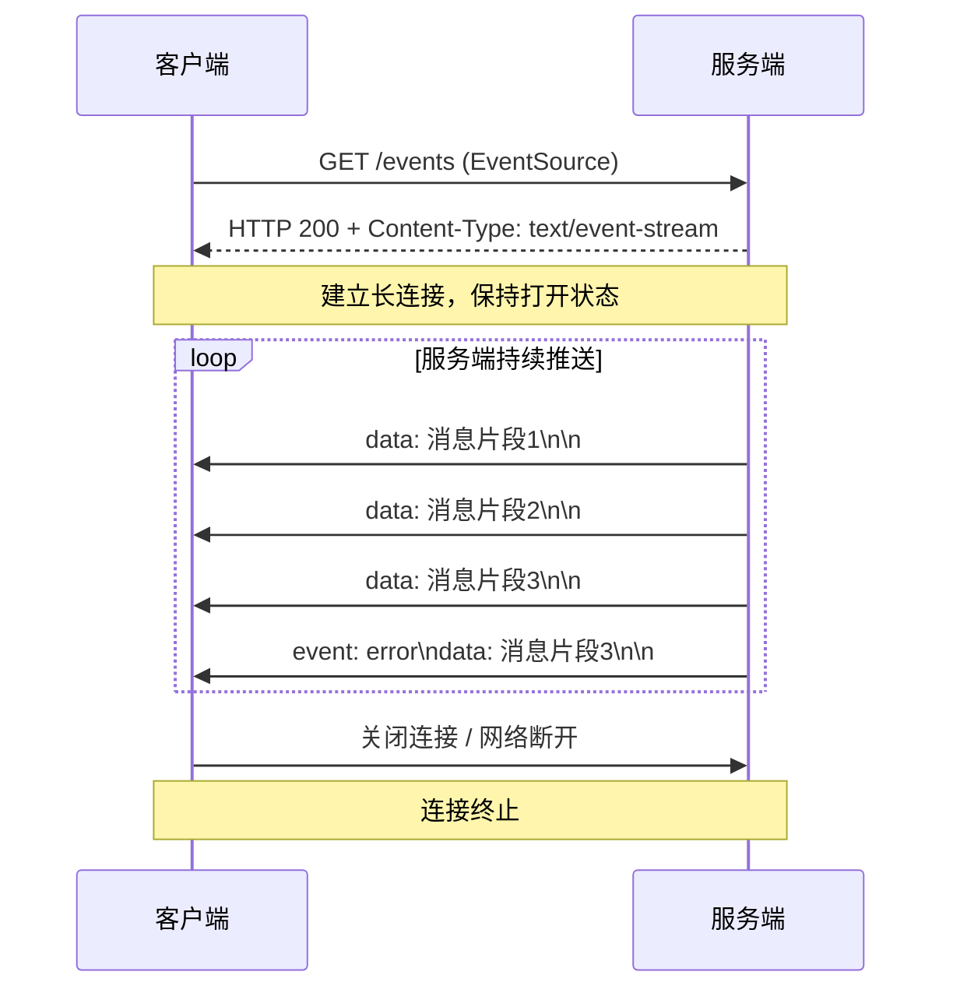
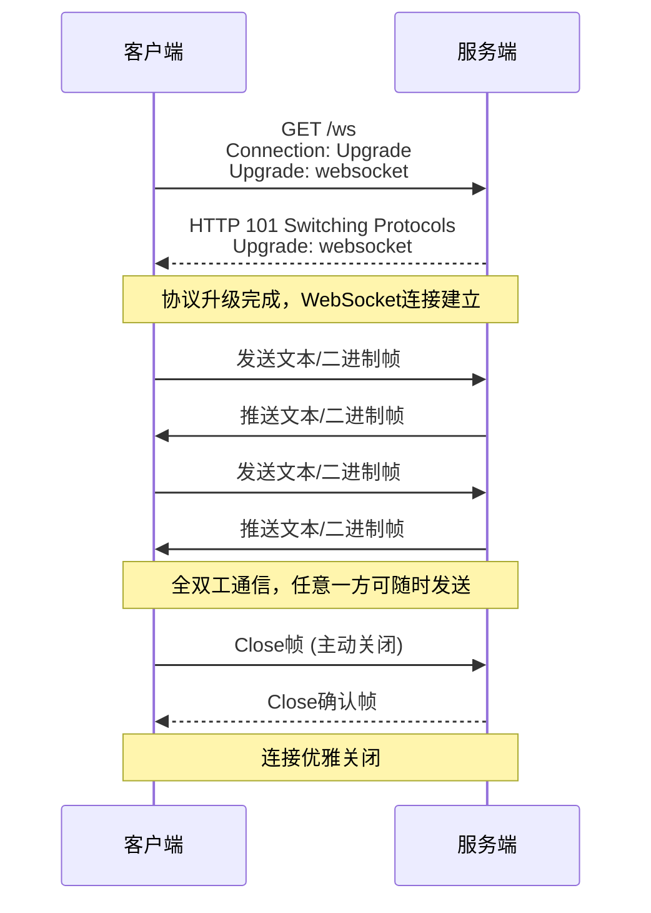

# 流式响应

## SSE模式



**关键特征**：
- 基于标准HTTP协议
- 单向通信：仅服务端→客户端推送
- 数据格式为`text/event-stream`，每条消息以双换行符(`\n\n`)结尾
- 适合新闻推送、股票行情、日志流等场景

Fast API 结合

| 项        | 信息                                                         |
| --------- | ------------------------------------------------------------ |
| 中间件    | 请求/响应会经过所有HTTP中间件<br />后续流式内容不经过中间件  |
| 异常处理  | 响应过程中的异常会经过异常处理函数<br />后续流式内容不经过异常处理函数 |
| 依赖注入  | 所有流式内容全部完成后才会迭代完成                           |
| token携带 | 原生`EventSource`只能将token放到query中<br />自定义或第三方库可以任意方式携带token |


## WebSocket模式



**关键特征**：
- 先通过HTTP握手，再升级为WebSocket独立协议（ws:// 或 wss://）
- 全双工通信：客户端和服务端均可主动发送消息
- 数据帧支持文本和二进制格式
- 适合在线聊天、多人协作、实时游戏等高频双向交互场景

Fast API 结合

| 项        | 信息                                         |
| --------- | -------------------------------------------- |
| 中间件    | 请求/响应都不会经过HTTP中间件                |
| 异常处理  | 不会经过异常处理函数                         |
| 依赖注入  | 连接断开后才会迭代结束                       |
| token携带 | 浏览器不支持自定义头，只能通过query携带token |


## SSE vs WebSocket 对比

| 特性 | SSE | WebSocket |
|------|-----|-----------|
| 通信方向 | 服务端→客户端（单向） | 全双工（双向） |
| 协议基础 | HTTP | 独立协议（基于HTTP握手） |
| 自动重连 | 原生支持 | 需手动实现 |
| 数据格式 | 文本（text/event-stream） | 文本或二进制 |
| 适用AI场景 | 简单的问答模式 | Agent 工作流<br />多人在线的AI协作 |

## 核心代码
本次主要实现api层的接口
:::code-group
```python [ai.py]
# ai的基础能力
from typing import Annotated

from fastapi import APIRouter, Depends
from sqlalchemy.ext.asyncio import AsyncSession

from zy_python_project.core.auth import get_current_user
from zy_python_project.core.database import get_db
from zy_python_project.model.user import User
from zy_python_project.schema.ai import AiMessageItem
from zy_python_project.service.ai_service import AiService

router = APIRouter(prefix="/ai", tags=["AI"])


@router.get("/conversation/{product_id}", response_model=list[AiMessageItem])
async def get_conversation_history(
    product_id: int,
    current_user: Annotated[User, Depends(get_current_user)],
    db: Annotated[AsyncSession, Depends(get_db)],
):
    return await AiService(db).get_history(current_user.id, product_id)


@router.delete("/conversation/{product_id}", status_code=204)
async def delete_conversation(
    product_id: int,
    current_user: Annotated[User, Depends(get_current_user)],
    db: Annotated[AsyncSession, Depends(get_db)],
):
    await AiService(db).delete_conversation(current_user.id, product_id)
```

```python [ai_sse.py.py]
# AI SSE返回接口
from typing import Annotated
from zy_python_project.exception.base import BusinessException
from sqlalchemy.ext.asyncio import AsyncSession
from zy_python_project.model.user import User
from fastapi import APIRouter, Depends, Request
from starlette.responses import StreamingResponse

from zy_python_project.core.auth import get_current_user, security_scheme
from zy_python_project.core.database import get_db, get_session_factory
from zy_python_project.schema.ai import AiSendMessageRequest
from zy_python_project.service.ai_service import AiService

router = APIRouter(prefix="/ai/sse", tags=["AI SSE"])


@router.get("/initialize/{product_id}")
async def initialize_conversation(
    request: Request,
    product_id: int,
    user: Annotated[User, Depends(get_current_user)],
    db: Annotated[AsyncSession, Depends(get_db)],
):
    request.state.is_stream = True
    svc = AiService(db)

    async def event_stream():
        try:
            async for chunk in svc.initialize(user.id, product_id):
                yield f"data: {chunk}\n\n"
        except BusinessException as e:
            yield f"event: error\ndata: {e.message}\n\n"
        except Exception as e:
            yield f"event: error\ndata: 未知异常\n\n"

    return StreamingResponse(event_stream(), media_type="text/event-stream")


@router.post("/message")
async def send_message(
    request: Request,
    data: AiSendMessageRequest,
    user: Annotated[User, Depends(get_current_user)],
    db: Annotated[AsyncSession, Depends(get_db)],
):
    request.state.is_stream = True
    svc = AiService(db)

    async def event_stream():
        try:
            async for chunk in svc.send_message_stream(
                user.id, data.product_id, data.content
            ):
                yield f"data: {chunk}\n\n"
        except BusinessException as e:
            yield f"event: error\ndata: {e.message}\n\n"
        except Exception as e:
            yield f"event: error\ndata: 未知异常\n\n"

    return StreamingResponse(event_stream(), media_type="text/event-stream")
```

```python [.py]
# AI websockte返回
import json

from fastapi import APIRouter, Query, WebSocket, WebSocketDisconnect

from zy_python_project.core.auth import get_user_from_token
from zy_python_project.core.database import get_session_factory
from zy_python_project.exception.ai import AiException
from zy_python_project.exception.auth import AuthException
from zy_python_project.service.ai_service import AiService

router = APIRouter()


@router.websocket("/{product_id}")
async def ai_websocket(
    websocket: WebSocket,
    product_id: int,
    token: str = Query(...),
):
    await websocket.accept()  # 协议升级
    db = get_session_factory()()
    try:
        user = await get_user_from_token(token, db)
    except AuthException:
        await db.close()
        await websocket.close(code=1008, reason="认证失败")
        return
    await db.close()
    user_id = user.id

    try:
        while True:
            raw = await websocket.receive_text()
            try:
                data = json.loads(raw)
            except json.JSONDecodeError:
                await websocket.send_json(
                    {"type": "error", "message": "无效的JSON格式"}
                )
                continue

            action = data.get("action")

            if action == "initialize":
                db = get_session_factory()()
                try:
                    svc = AiService(db)
                    async for chunk in svc.initialize(user_id, product_id):
                        await websocket.send_json({"type": "chunk", "content": chunk})
                    await websocket.send_json({"type": "done"})
                    await db.commit()
                except AiException as e:
                    await websocket.send_json(
                        {"type": "error", "message": e.message, "detail": e.detail}
                    )
                finally:
                    await db.close()

            elif action == "send_message":
                content = data.get("content", "").strip()
                if not content:
                    await websocket.send_json(
                        {"type": "error", "message": "消息内容不能为空"}
                    )
                    continue

                db = get_session_factory()()
                try:
                    svc = AiService(db)
                    async for chunk in svc.send_message_stream(
                        user_id, product_id, content
                    ):
                        await websocket.send_json({"type": "chunk", "content": chunk})
                    await websocket.send_json({"type": "done"})
                    await db.commit()
                except AiException as e:
                    await websocket.send_json(
                        {"type": "error", "message": e.message, "detail": e.detail}
                    )
                finally:
                    await db.close()

            else:
                await websocket.send_json(
                    {"type": "error", "message": f"未知操作: {action}"}
                )

    except WebSocketDisconnect:
        print("断开")
        pass
```
:::

要注意的是SSE和websocket模式下,中间件以及异常的处理只会在最开始接口调用的时候触发一次，之后再次消息发送的时候，需要自己自定义异常，也不要统一响应格式了。