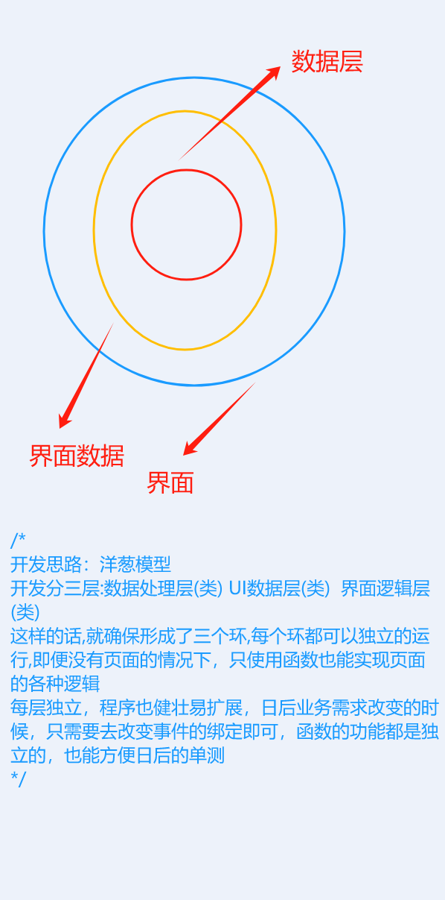
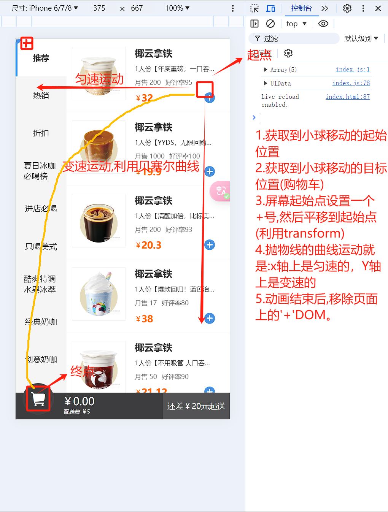

# 购物车效果

此案例采用的是面向对象的思想，需要有一定的编码基础，重点在于体会。
其中，用到了洋葱圈模型。
难点是，购物车点击加号商品飞入的动画。

## 思路

- 数据
  准备好数据，此数据是原始数据，需要处理成我们需要的数据
  将单件商品数据封装成一个类，类中有添加/删除/计算商品单价/是否选中的方法
  将整个 UI 需要的数据封装成一个类，类中有添加/删除/计算商品单价/是否选中的方法...
- UI 逻辑
  将整个 UI 的逻辑封装成一个类，类中主要是初始化 dom 和对 dom 操作的一些方法。

## 扩展-洋葱圈模型

所谓洋葱圈模型是指,从外部到内部，每一个层都有自己的逻辑，如果想要访问到内部的东西，直接访问外部的这个类预留的接口即可。


## 扩展-购物车飞入动画



## 代码

:::code-group

```html [index.html]
<!DOCTYPE html>
<html lang="en">
  <head>
    <meta charset="UTF-8" />
    <meta http-equiv="X-UA-Compatible" content="IE=edge" />
    <meta name="viewport" content="width=device-width, initial-scale=1.0" />
    <title>丑团外卖</title>
    <link rel="shortcut icon" href="./assets/favicon.ico" type="image/x-icon" />
    <link rel="stylesheet" href="./css/common.css" />
    <link rel="stylesheet" href="./css/container.css" />
    <link rel="stylesheet" href="./css/footer.css" />
    <link rel="stylesheet" href="./css/add-to-car.css" />
  </head>

  <body>
    <div class="container">
      <div class="menu">
        <div class="menu-item active"><span>推荐</span></div>
        <div class="menu-item"><span>热销</span></div>
        <div class="menu-item"><span>折扣</span></div>
        <div class="menu-item"><span>夏日冰咖必喝榜</span></div>
        <div class="menu-item"><span>进店必喝</span></div>
        <div class="menu-item"><span>只喝美式</span></div>
        <div class="menu-item"><span>酷爽特调水果冰萃</span></div>
        <div class="menu-item"><span>经典奶咖</span></div>
        <div class="menu-item"><span>创意奶咖</span></div>
        <div class="menu-item"><span>瑞纳冰季</span></div>
        <div class="menu-item"><span>不喝咖啡</span></div>
        <div class="menu-item"><span>轻食甜品</span></div>
        <div class="menu-item"><span>热卖套餐</span></div>
      </div>
      <div class="goods-list"></div>
    </div>
    <div class="footer">
      <div class="footer-car-container">
        <div class="footer-car">
          <i class="iconfont i-gouwuchefill"></i>
          <span class="footer-car-badge">0</span>
        </div>
        <div class="footer-car-price">
          <span class="footer-car-unit">￥</span>
          <span class="footer-car-total">0.00</span>
        </div>
        <div class="footer-car-tip">配送费￥0</div>
      </div>
      <div class="footer-pay">
        <a href="">去结算</a>
        <span>还差￥0元起送</span>
      </div>
    </div>

    <!-- <div class="add-to-car">
    <i class="iconfont i-jiajianzujianjiahao"></i>
  </div> -->

    <script src="./js/data.js"></script>
    <script src="./js/index.js"></script>
  </body>
</html>
```

```js [data.js]
var goods = [
  {
    pic: "./assets/g1.png",
    title: "椰云拿铁",
    desc: `1人份【年度重磅，一口吞云】

    √原创椰云topping，绵密轻盈到飞起！
    原创瑞幸椰云™工艺，使用椰浆代替常规奶盖
    打造丰盈、绵密，如云朵般细腻奶沫体验
    椰香清甜饱满，一口滑入口腔
    
    【饮用建议】请注意不要用吸管，不要搅拌哦~`,
    sellNumber: 200,
    favorRate: 95,
    price: 32,
  },
  {
    pic: "./assets/g2.png",
    title: "生椰拿铁",
    desc: `1人份【YYDS，无限回购】
    现萃香醇Espresso，遇见优质冷榨生椰浆，椰香浓郁，香甜清爽，带给你不一样的拿铁体验！
    
    主要原料：浓缩咖啡、冷冻椰浆、原味调味糖浆
    图片及包装仅供参考，请以实物为准。建议送达后尽快饮用。到店饮用口感更佳。`,
    sellNumber: 1000,
    favorRate: 100,
    price: 19.9,
  },
  {
    pic: "./assets/g3.png",
    title: "加浓 美式",
    desc: `1人份【清醒加倍，比标美多一份Espresso】
    口感更佳香醇浓郁，回味持久
    图片仅供参考，请以实物为准。建议送达后尽快饮用。`,
    sellNumber: 200,
    favorRate: 93,
    price: 20.3,
  },
  {
    pic: "./assets/g4.png",
    title: "瓦尔登蓝钻瑞纳冰",
    desc: `1人份【爆款回归！蓝色治愈力量】
    灵感来自下澄明、碧蓝之境---瓦尔登湖。含藻蓝蛋白，梦幻蓝色源自天然植物成分，非人工合成色素，融入人气冷榨生椰浆，椰香浓郁，清冽冰爽；底部添加Q弹小料，0脂原味晶球，光泽剔透，如钻石般blingbling。搭配奶油顶和彩虹色棉花糖，满足你的少女心～
    【去奶油小提示】由于去掉奶油后顶料口味会受影响，为保证口感，选择“去奶油”选项时将同时去掉奶油及顶料，请注意哦！【温馨提示】瑞纳冰系列产品形态为冰沙，无法进行少冰、去冰操作，请您谅解。【图片仅供参考，请以实物为准】`,
    sellNumber: 17,
    favorRate: 80,
    price: 38,
  },
  {
    pic: "./assets/g5.png",
    title: "椰云精萃美式",
    desc: `1人份【不用吸管 大口吞云！】

    1杯热量*≈0.6个苹果！
    原创瑞幸椰云™工艺，将「椰浆」变成绵密、丰盈的“云朵”，口感绵密顺滑！0乳糖植物基，清爽轻负担！
    
    *数据引自《中国食物成分表》第六版，苹果每100克可食部分中能量约为53千卡，以每个苹果250克/个计，1杯椰云精萃美式约80千卡，相当于约0.6个苹果。
    【图片仅供参考，请以实物为准】`,
    sellNumber: 50,
    favorRate: 90,
    price: 21.12,
  },
];
```

```js [index.js]
console.log(goods);

// 单件商品的数据
class Goods {
  constructor(g) {
    this.data = g;
    this.chooseCount = 0;
  }

  //  增加单个商品
  increase() {
    this.chooseCount++;
  }
  // 减少单个商品
  decrease() {
    if (this.chooseCount === 0) return;
    this.chooseCount--;
  }
  //单个商品的总价
  getTotalPrice() {
    return this.chooseCount * this.data.price;
  }
  //是否选中了此商品
  isChoose() {
    return this.chooseCount > 0;
  }
}

// let ugoods=new Goods(goods[0]);

// 页面数据
class UIData {
  constructor() {
    //构造页面需要的全部数据--由单个数据的对象构造生成的集合
    this.goodsData = goods.map((item) => new Goods(item));
    this.posefee = 5; //配送费
    this.postThreshold = 20; //多少起送
  }

  // 增加商品
  increase(index) {
    this.goodsData[index].chooseCount++;
  }

  // 减少商品
  decrease(index) {
    if (this.goodsData[index].chooseCount === 0) return;
    this.goodsData[index].chooseCount--;
  }
  // 购物车中的商品数量
  getCartCount() {
    return this.goodsData.reduce((total, current) => {
      return (total += current.chooseCount);
    }, 0);
  }
  //购物车总价
  getTotalPrice() {
    return this.goodsData.reduce((total, current) => {
      return (total += current.getTotalPrice());
    }, 0);
  }
  //购物车是否有商品
  hasGoodsInCart() {
    return this.getCartCount() > 0;
  }
  //是否跳过起送门槛
  isSkipPostThreshold() {
    return this.getTotalPrice() >= this.postThreshold;
  }

  //是否选中了商品
  isChoose(index) {
    return this.goodsData[index].isChoose();
  }
}

const uidata = new UIData();
console.log(uidata);

//页面UI
class UI {
  constructor() {
    //页面数据
    this.uidata = new UIData();
    //页面DOOMS
    this.doms = {
      goodsList: document.querySelector(".goods-list"),
      //
      footerCarTip: document.querySelector(".footer-car-tip"),
      footerPay: document.querySelector(".footer-pay"),
      footThreshold: document.querySelector(".footer-pay span"),
      footTotalPrice: document.querySelector(".footer-car-total"),
      //
      cart: document.querySelector(".footer-car"),
      badge: document.querySelector(".footer-car-badge"),
    };
    this.initDOM();
    this.updateFootDom();
    //购物车坐标
    this.targetPoint = this.getCartPoint();
  }

  // 初始化dom
  initDOM() {
    let html = "";
    this.uidata.goodsData.forEach((item, index) => {
      html += `<div class="goods-item">
          
          <div class="goods-info">
            <h2 class="goods-title">椰云拿铁</h2>
            <p class="goods-desc">
              ${item.data.desc}
            </p>
            <p class="goods-sell">
              <span>月售 ${item.data.sellNumber}</span>
              <span>好评率${item.data.favorRate}</span>
            </p>
            <div class="goods-confirm">
              <p class="goods-price">
                <span class="goods-price-unit">￥</span>
                <span>${item.data.price}</span>
              </p>
              <div class="goods-btns">
                <i data-index=${index} class="iconfont i-jianhao"></i>
                <span>${item.chooseCount}</span>
                <i data-index=${index} class="iconfont i-jiajianzujianjiahao"></i>
              </div>
            </div>
          </div>
        </div>`;
    });
    this.doms.goodsList.innerHTML = html;
  }

  //增加商品
  increase(index) {
    this.uidata.increase(index);
    this.updateGoodsItemDom(index);
    this.updateFootDom();
    this.jumpAnimate(index);
  }

  //减少商品
  decrease(index) {
    this.uidata.decrease(index);
    this.updateGoodsItemDom(index);
    this.updateFootDom(index);
  }

  //增加和删除的更新dom
  updateGoodsItemDom(index) {
    const currGoods = this.doms.goodsList.children[index];
    //显示加减框
    if (this.uidata.isChoose(index)) {
      currGoods.classList.add("active");
    } else {
      currGoods.classList.remove("active");
    }
    //更新数量框
    const span = currGoods.querySelector(".goods-btns span");
    span.textContent = this.uidata.goodsData[index].chooseCount;
  }

  //更新页脚
  updateFootDom() {
    const total = this.uidata.getTotalPrice().toFixed(2);
    //配送费
    this.doms.footerCarTip.textContent = `配送费 ￥${this.uidata.posefee}`;
    //设置配送费还差多少
    if (this.uidata.isSkipPostThreshold()) {
      this.doms.footerPay.classList.add("active");
    } else {
      this.doms.footerPay.classList.remove("active");
      //门槛
      this.doms.footThreshold.textContent = `还差￥${Math.round(
        this.uidata.postThreshold - total
      )}元起送`;
    }
    //总价
    this.doms.footTotalPrice.textContent = `${total}`;
    //购物车
    if (this.uidata.hasGoodsInCart()) {
      this.doms.cart.classList.add("active");
    } else {
      this.doms.cart.classList.remove("active");
    }
    //购物车徽标
    this.doms.badge.textContent = this.uidata.getCartCount();
  }

  //动画-购物车抖动
  ceateAnimate() {
    this.doms.cart.classList.add("animate");
  }
  //动画-'+'抛物线动画
  jumpAnimate(index) {
    //起始点
    const addDom = this.doms.goodsList.children[index].querySelector(
      ".goods-btns .i-jiajianzujianjiahao"
    );
    const addRect = addDom.getBoundingClientRect();
    const startPoint = {
      x: addRect.left,
      y: addRect.top,
    };
    //创建元素
    const div = document.createElement("div");
    div.className = "add-to-car";
    const i = document.createElement("i");
    i.className = "iconfont i-jiajianzujianjiahao";
    div.style.transform = `translateX(${startPoint.x}px)`;
    i.style.transform = `translateY(${startPoint.y}px)`;
    div.appendChild(i);
    document.body.appendChild(div);
    //跳动
    /* 强行渲染动画,如果不强行渲染的话，主线程只会执行完js之后，才开始执行渲染流程,
      所以只会有下面的效果，而初始位置的效果没有被渲染。 
      requestAnimationFrame();
    */
    div.clientWidth;
    div.style.transform = `translateX(${this.targetPoint.x}px)`;
    i.style.transform = `translateY(${this.targetPoint.y}px)`;
    //动画结束
    div.addEventListener(
      "transitionend",
      () => {
        div.remove();
        this.ceateAnimate();
      },
      {
        once: true, //因为i标签也有过度效果,如果不加once,会冒泡到div，从而触发两次结束了回调函数
      }
    );
  }
  //获取购物车坐标
  getCartPoint() {
    // 购物车终点坐标
    const cartRect = this.doms.cart.getBoundingClientRect();
    const targetPoint = {
      x: cartRect.left + cartRect.width / 2,
      y: cartRect.top + cartRect.height / 5, //高度随意，这里取得是五分之一
    };
    return targetPoint;
  }
}

const ui = new UI();

// 事件
// 利用事件委托，来进行事件的绑定
ui.doms.goodsList.addEventListener("click", function (e) {
  console.log(e);
  if (e.target.classList.contains("i-jiajianzujianjiahao")) {
    //此处的index可以通过H5的自定义属性来获取,data-index
    // console.log(e.target.dataset.index);
    ui.increase(e.target.dataset.index);
  } else if (e.target.classList.contains("i-jianhao")) {
    ui.decrease(e.target.dataset.index);
  }
});

/* 
抛物线原理:
1.实际上是小球在x轴上匀速运动,y轴上变速运动形成的抛物线
2.使用方法是div在x轴上匀速运动,让i标签在y轴上变速,div带动着i标签进行移动
3.利用transition的贝塞尔曲线，可以设置i在y轴上的运动动画效果
*/

/* 
开发思路：洋葱模型
开发分三层:数据处理层(类) UI数据层(类)  界面逻辑层(类)
这样的话,就确保形成了三个环,每个环都可以独立的运行,即便没有页面的情况下，只使用函数也能实现页面的各种逻辑
每层独立，程序也健壮易扩展，日后业务需求改变的时候，只需要去改变事件的绑定即可，函数的功能都是独立的，也能方便日后的单测
*/
```

:::
