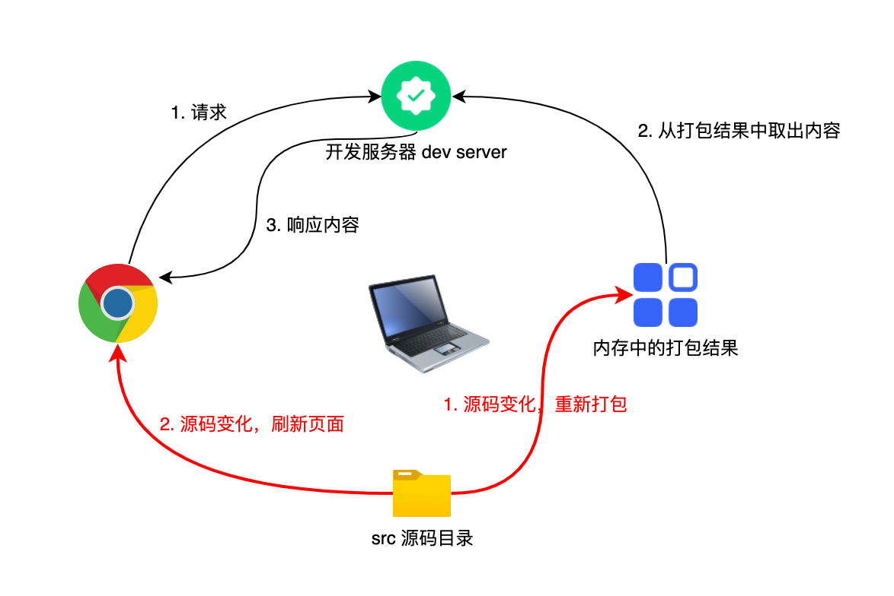
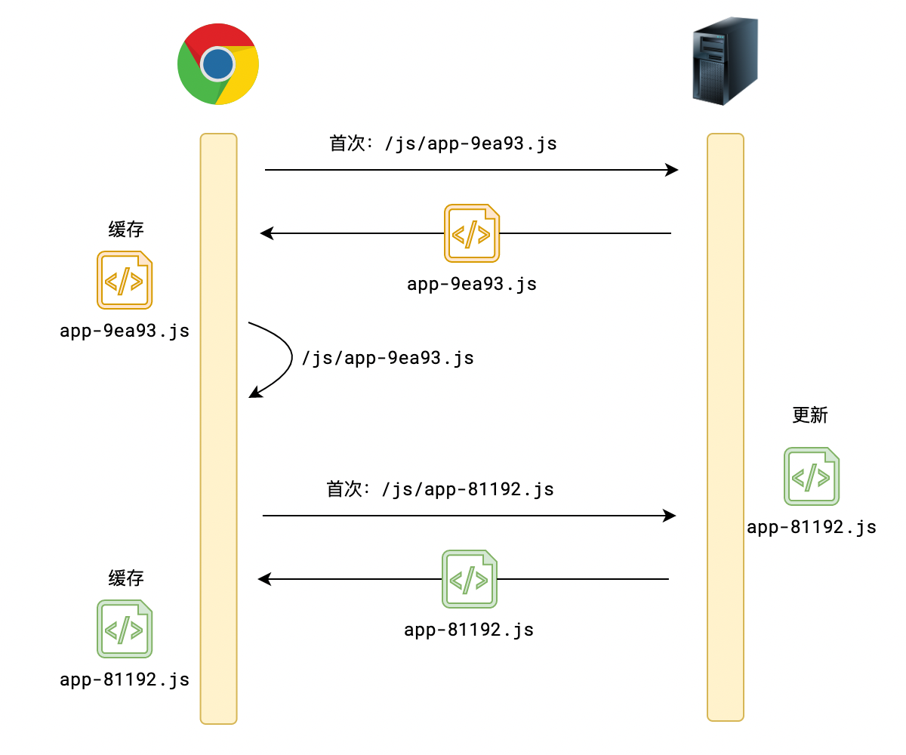
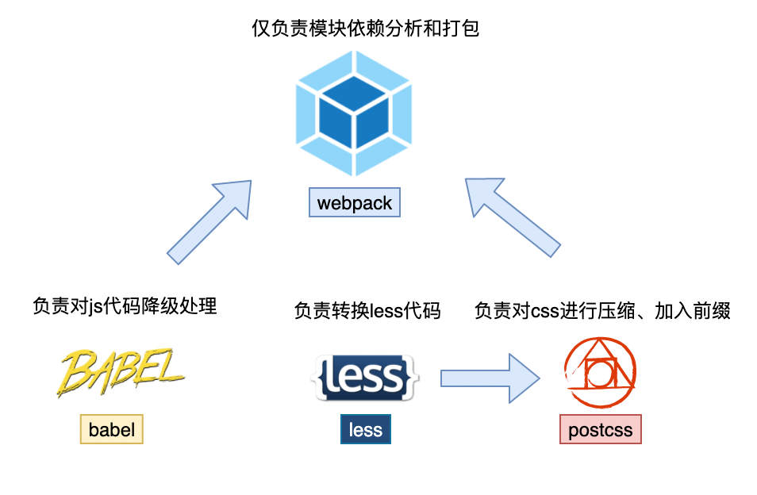

> **工程化，为复杂应用而生**
>
> 本文为保持简单，牺牲了某些语言的准确性

# 核心

**webpack是用来搭建前端工程的**

它运行在node环境中，它所做的事情，简单来说，就是**打包**


具体来说，就是以某个模块作为入口，根据入口分析出所有模块的依赖关系，然后对各种模块进行合并、压缩，形成最终的打包结果

**在webpack的世界中，一切皆是模块**

# 体验

> 老师提供的工程，以`src/main.js`作为入口文件
>
> 按照习惯，所有的模块均放置在`src`目录中

1. 安装依赖

2. 编写多个模块

   随意编写一些模块，可以是js、图片、音视频，以入口模块为起点，形成依赖关系

3. 运行`npm run build`命令，进行打包

4. 查看打包结果

   打包结果放置在dist目录中

通过上面的体验，可以发现，webpack给我们带来了至少以下好处：

- 可以大胆的使用任意模块化标准

  无须担心兼容性问题，因为webpack完成打包后，已经没有了任何模块化语句

- 可以将一些非JS代码也视为模块

  这样可以对css、图片等资源进行更加细粒度的划分

- 在前端开发中，也可以使用npm

  webpack不会运行你的源代码，无论是你自己写的模块，还是通过npm安装的模块，webpack一视同仁，统统视为依赖，最终合并到打包结果中

- 非常适合开发单页应用

  单页应用是前端用户体验最好的web应用

  所谓单页应用，是指只有一个html页面，页面中没有任何内容，所有的内容均靠js生成

  要优雅的实现单页应用，最好依托于前端框架，比如vue、react

webpack给我们开发带来的变化远不止于此，接下来一一体验

# 页面模板

对于单页应用而言，只有一个空白的页面，所有内容都靠JS代码创建

webpack会自动生成一个页面，并且在页面中会自动加入对js和css的引用

它生成页面时，参考的是`public/index.html`，其称之为页面模板

# public目录

webpack会非常暴力的将public目录中的所有文件（除页面模板外），复制到打包结果中

# 开发服务器

如果每次修改完代码，都要经过`打包->运行`，未免太过麻烦

在开发阶段，我们可以运行`npm run serve`命令获得更好的打包体验

该命令会让`webpack`启动一个**开发服务器**。

在这个阶段，webpack并不会形成打包结果文件，而是把打包的内容放到内存中，当我们请求服务器时，服务器从内存中给予我们打包结果

与此同时，当源码发生变动时，webpack会自动重新打包，同时刷新页面以访问到最新的打包结果



# 文件缓存

可以看到，除了页面外，其他的资源在打包完成后，文件名多了一些奇奇怪怪的字符

例如：`js/app-9ea93.js`

其中，`9ea93`这样的字符称之为`hash`，它会随着模块内容的变化而变化

**源码内容不变，hash不变；源码内容变化，hash变化**

之所以这样做，是因为生产环境中，浏览器会对除页面外的静态资源进行缓存

如果不设置hash值，一旦代码更新，浏览器还会使用之前缓存的结果，无法使用最新的代码


有了hash值之后，即可解决此问题



webpack会在打包时自动处理hash值，并不会对我们写代码造成任何影响，但作为一个前端开发者，有必要了解这一点

# 资源路径

**除js代码和样式模块外，其他模块被视为资源模块**

值得特别注意的是，**资源模块在源代码中的路径和打包后的路径是不一样的**，这就导致我们在编写代码的时候，根本无法知晓最终的路径

最常见的例子，就是在css中使用背景图片

```css
.container{
  /* 背景图使用了源码中的路径 */
  backgroud: url('../assets/1.png'); 
}
```

它能正常工作吗？

它能！

因为webpack非常智能的发现了这一点，对于css中的路径，webpack在打包时，会将其自动转换为打包结果的路径，比如，上面的代码在打包完成后，可能被转换为下面的格式

```css
.container{
  /* css中的资源路径会被自动替换，我们无须关心 */
  background: url(/img/1492ea.png);
}
```

但如果我们要通过js动态的使用路径，webpack是无法识别的

```js
// 打包前
const url = './assets/1.png'; // 该路径无法被转换
img.src = url;

// 打包后
const url = './assets/1.png'; // ❌
img.src = url;
```

正确的做法是，通过模块化的方式导入资源，并获取资源路径(这就是为什么在js代码中引入图片路径之后却不生效的原因)

```js
// 打包前
import url from './assets/1.png'; // 打包后，url得到的将是真实的路径
img.src = url;

// 打包后
const url = '/img/1492ea.png'; // ✅
img.src = url;
```

# 缺省的文件和后缀名

导入模块时，所有js模块均可省略`.js`，若导入的模块文件名为`index.js`，可省略文件名

```js
import './home'; // 若存在home.js，可省略js
import './movie'; // 若movie是一个目录，此次导入的是 ./movie/index.js
```

# 路径别名

随着体量的增长，不可避免的，会形成层级极深的目录

```shell
root
	|- src
		|- a
				|- a1
						|- a2
							 |- index.js
		|- b
				|- b1
						|- index.js
```

如果需要在`./src/a/a1/a2/index.js`中导入`./src/b/b1/index.js`，则可能产生下面特别恶心的代码

```js
import '../../../b/b1/index.js';
```

webpack提供了别名供我们快速定位到`./src`目录，通常，该别名为`@`

上面的导入代码可简化为

```js
import '@/b/b1'; // @表示src目录，同时省略了index.js
```

# js兼容性

当webpack读取到js代码时，会自动对其进行兼容性处理

具体的处理方案涉及到两个配置文件：

- `babel.config.js`：通过配置该文件，可以设置对哪些js代码进行降级处理
- `.browserslistrc`：通过配置该文件，可以设置在降级时，要兼容哪些浏览器，兼容的范围越光，降级产生的代码就越多，自然，打包后的体积就越大

你无须知晓具体的配置方式

# 打包压缩

webpack在打包时，会对所有js和css代码进行压缩

对于js，除了压缩之外，还会对其中的各种名称进行混淆

```js
(self.webpackChunkmovie_list=self.webpackChunkmovie_list||[]).push([[587],{3587:(r,t,n)=>{"use strict";n.r(t),n(5666),n(1539),n(8674),n(9600),n(1249),n(2222);var e=n(9755),a=n.n(e);var o;function i(r){o.html(r.map((function(r){return'<li>\n  <a href="'.concat(r.url,'" target="_blank">\n    \n  </a>\n  <a href="').concat(r.url,'" target="_blank" class="').concat("qmUYQv1xlJhGMQKz-kfAp",'">').concat(r.title,'</a>\n  <p class="').concat("_3yV5wC-URYTUP0sPvaE0ZR",'">').concat(r.rate,"</p>\n  </li>")})).join(""))}o=a()("<ul>").addClass("_1fsrc5VinfYHBXCF1s58qS").appendTo("#app");var c=n(8138);const u=
```

混淆的作用一方面是为了进一步压缩包体积，另一方面是为了让我们的代码更难被其他人理解利用

# 源码地图 source map

我们运行的是webpack打包后的结果，而打包后的结果是很难阅读的

但这样一来会带来新的问题，如果代码报错，我们就难以知道到底是那一行代码写的有问题

此时源码地图就发挥了作用

可以发现，js代码打包后都会跟上一个同名的、后缀为`.map`的文件，该文件就保存了原始代码的内容

请放心，这个内容人类是看不懂的，但浏览器可以看懂

当代码报错时，浏览器会定位到源码地图中的对应代码，而不是把真实报错的代码展示给我们

你无须关心这一点，但可以自然的从其中获得巨大的便利

# css工程化

webpack能够识别**所有**的样式代码，包括`css`、`less`、`sass`、`stylus`

在打包时，会将它们转换成纯正的`css`

除此之外，它还具备以下的神奇能力

## 自动厂商前缀

css有很多兼容性问题，解决这些兼容性问题的最常见办法，就是加上厂商前缀。

比如：

```css
/* 兼容性不好的代码 */
.container{
	display: flex;
  transition: 1s;
}

/* 兼容性好的代码 */
.container {
  display: -webkit-box;
  display: -webkit-flex;
  display: flex;
  -webkit-transition: 1s;
  transition: 1s;
}
```

webpack会根据`.browserlistrc`中指定的浏览器范围，**按需、自动**加上厂商前缀

我们开发无须关心

## css module

css文件多了后，你怎么保证它们里面没有冲突的类样式？

靠层级选择器？就不担心效率？

靠命名规范？就不担心脑袋爆炸？

要靠就靠css module

当样式文件以`xxx.mdoule.xxx`的方式命名时，webpack会将该文件当成一个开启了`css module`的文件

比如：`index.module.less`、`movie.module.css`，都是开启了`css module`的文件

**文件中的所有类名都会被hash化**

```less
// 源码
.container{}
.list{}
.item{}

// 打包结果，绝无可能重名
._2GFVidHvoHtfgtrdifua24{}
._1fsrc5VinfYHBXCF1s58qS{}
.urPUKUukdS_UTSuWRI5-5{}
```

现在就一个问题，我们在使用类名时，如何知道它打包结果的类名呢？

```js
import './index.module.less';
dom.classList.add('container'); // ❌ 最终的类名可不是这个
```

正确的方式如下：

```js
// styles 是一个对象，里面映射了源码类名和打包类名的关系
import styles from './index.module.less';
dom.classList.add(styles.container); // ✅ 属性container中记录的就是container转换后的类名
```


# 真正的webpack没有那么神奇

实际上，webpack没有做这么多事，我们不能把功劳（怨念）全归结于它

它只是站在巨人（其他流氓）肩膀上而已

下图可以看个热闹



webpack通过插件（plugin）和加载器（loader）将这些技术整合在一起

`上图的技术 + 乱七八糟一大堆其他技术 + 老师的配置 = 呈现给你的工程`

目前，你无须理解这一些，保持敬畏即可

最后，说明一下工程中看不懂的文件：

- `.browserslistrc`，表达适配的浏览器范围，会被工程化中的其他技术所使用
- `babel.config.js`，`babel`的配置文件，做js降级处理
- `postcss.config.js`，`postcss`的配置文件，做css代码转换
- `webpack.config.js`，`webpack`的配置文件，整合其他工程化技术，以及配置打包细节、开发服务器、路径别名等等

# 对我们开发的影响

1. 学会访问开发服务器查看效果

2. 学会动态获取资源文件路径

   ```js
   import url from './assets/1.png'; 
   img.src = url;
   ```

3. 学会省略文件和后缀名

   ```js
   import './home'; // 若存在home.js，可省略js
   import './movie'; // 若movie是一个目录，此次导入的是 ./movie/index.js
   ```

4. 学会使用别名简化导入代码

   ```js
   import '@/b/b1'; // 实际导入： src/b/b1/index.js  (若b1是目录)
   ```

5. 学会使用css module

   ```js
   // styles 是一个对象，里面映射了源码类名和打包类名的关系
   import styles from './index.module.less';
   dom.classList.add(styles.container); 
   ```

# 作业

## 回顾和总结1

看着此笔记的目录，大声**说出**每个目录标题板块的内容

## 回顾和总结2

脱离此文档，能够**说出**整个文档的大致内容

