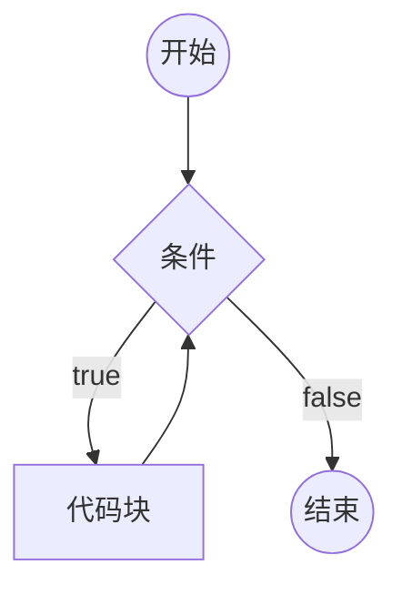
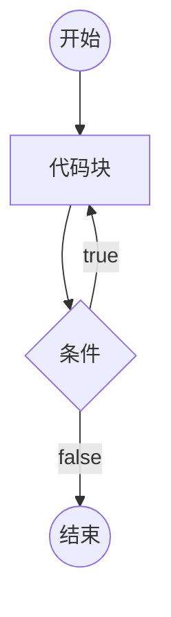
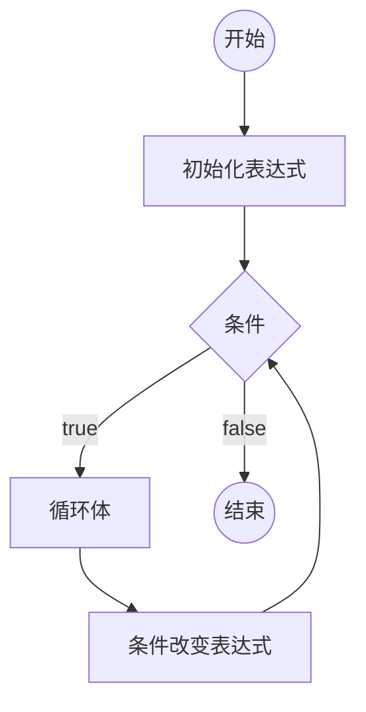

# 流程控制

## if判断

```js
if (条件1) {
  // 代码块
} else if (条件2) {
  // 代码块
} else if (条件3) {
  // 代码块
}
//....
else {
  // 以上条件都不满足执行的代码块
}
```

1. 如果某个条件满足，则直接忽略后面的所有条件
2. else if 可以有多个（包含0个）
3. else可以有1个或0个
4. else可以换行，可以不换行
5. 如果代码块只有一条语句，可以省略花括号（不推荐）
6. if只能出现一次

**补充**

1. 用户输入: prompt("提示文本")

该表达式返回结果：

1. null：表示用户点击了取消
2. 用户输入的字符串：表示用户点击了确定，得到用户输入的结果

返回类型：null 或 字符串

2. 将字符串转换成数字：+字符串

3. 得到一个随机数

Math.random() 该表达式返回一个0~1之间的随机数字（无法取到1）

## switch开关

switch的语法始终可以使用if结构替代。

```js
switch (表达式) {
  case 数据1:
    代码块;
    break;
  case 数据2:
    代码块;
    break;
  default:
    代码块;
    break;
}
```

1. 计算表达式的返回值，依次和case后面的数据进行严格相等的比较，如果某个相等，停止比较，然后运行其内部的代码块，再然后，依次运行之后的所有代码块。
2. 在case分支内部，使用`break`语句，可以立即停止switch结构。
3. default表示前面的所有case都不匹配时运行。可以省略

## 循环

重复的运行一段代码

JS支持3种循环结构：while循环、do-while循环、for循环

## while循环

```js
while(条件){
    代码块（循环体）
}
```



死循环：条件永远满足，永远无法退出循环。

## do-while循环

```js
do {
  循环体;
} while (条件);
```



## for循环

```js
for (初始化表达式; 条件; 条件改变表达式) {
  循环体;
}
```



## 循环中的关键字

循环控制语句

- break; 跳出循环
- continue; 停止当前循环体，进入下一次循环。

## 循环应用

### 累计

举例：将1-100的所有数字相加之和

思路：准备一个变量，初始值为0，然后1-100循环，每次循环，将数字累加到变量中。

```js
// 1-100 数字相加
var sum = 0; //最终的和
for (var i = 1; i <= 100; i++) {
  sum += i;
}
console.log(sum);

// 1-10 数字相乘
var sum = 1;
for (var i = 1; i <= 10; i++) {
  sum *= i;
}
console.log(sum);

// 1-100 所有奇数相加
var sum = 0;
for (var i = 1; i <= 100; i++) {
  if (i % 2 !== 0) {
    sum += i;
  }
}
console.log(sum);
```

### 查找

举例：135~145之间是否存在能整除26的数字

思路：准备一个变量，记录false，表示没有找到，然后135-145进行循环，如果发现满足条件的数字，重新记录变量为true，表示找到了，然后退出循环。

```js
// 135-145 之间是否存在 能整除26的数字
var isFind = false; //是否找到
var min = 135;
var max = 145;
for (var i = min; i <= max; i++) {
  if (i % 26 === 0) {
    isFind = true;
    break;
  }
}
if (isFind) {
  console.log("存在");
} else {
  console.log("不存在");
}

// 打印135-185之间所有能整除26的数字
for (var i = 135; i <= 185; i++) {
  if (i % 26 === 0) {
    console.log(i);
  }
}

// 打印135-185之间第一个能整除26的数字，如果不存在，输出不存在
var isFind = false;
for (var i = 135; i <= 185; i++) {
  if (i % 26 === 0) {
    console.log(i);
    isFind = true;
    break;
  }
}
if (!isFind) {
  console.log("不存在");
}

// 判断一个数是不是素数（质数）
// 素数：一个大于1的整数，只能被1和自身整除
// 比如：2是一个素数
// 比如：4不是一个素数
// 思路：从1循环到这个数，记录有多少个数字能整除它，

var num = 1;
var isFind = false; //没有找到
for (var i = 2; i < num - 1; i++) {
  if (num % i === 0) {
    isFind = true;
    break;
  }
}
if (num <= 1 || isFind) {
  console.log("不是素数");
} else {
  console.log("是素数");
}

var record = 0; //记录整除数量
for (var i = 1; i <= num; i++) {
  if (num % i === 0) {
    record++;
  }
}
if (record === 2) {
  console.log("是素数");
} else {
  console.log("不是素数");
}
```

### 嵌套的循环

分开分析两层循环

```js
// 打印1-100的所有素数
for (var i = 1; i <= 100; i++) {
  // 判断i是不是素数
  var isFind = false; //没有找到
  for (var j = 2; j < i - 1; j++) {
    if (i % j === 0) {
      isFind = true;
      break;
    }
  }
  if (i > 1 && !isFind) {
    console.log(i);
  }
}
```
