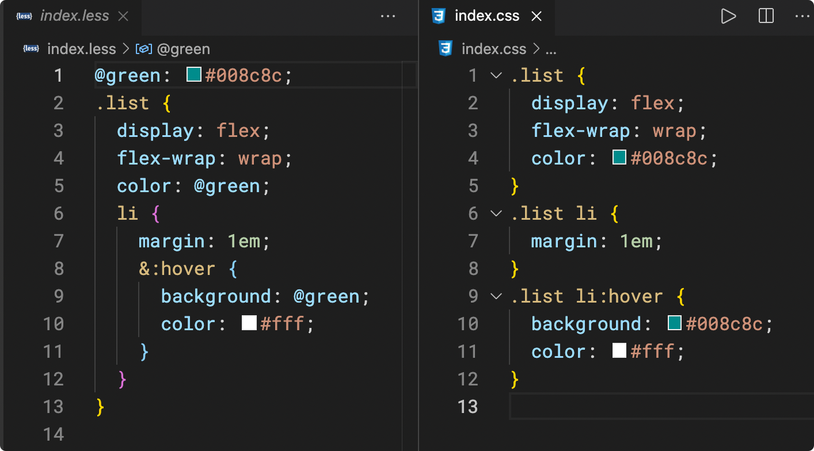

# 什么是 Less？

**Less**是一种更加简洁的样式代码，它非常像 CSS，但又不太一样，它让编写样式变得更容易

下面是 css 代码和 Less 代码的对比，它们都表达了一样的含义



**Less 代码虽好，但它无法被浏览器识别**，因此需要一个工具将其转换为血统纯正的 css 代码

由于**node 环境具有读写文件的能力**，于是在 node 环境中可以轻松的完成文件的转换

`npm`上有一个包叫做`less`，它运行在 node 环境中，通过它可以完成对 Less 代码的转换


**可以看出，node 环境在前端工程化中，充当了一个辅助的角色，它并不直接运行前端代码，而是让我们编写前端代码更加舒适便利，在后续的课程中，你还会不断的体会到这一点**

**转换代码，称之为编译(compile)，转换代码的工具，称之为编译器(compiler)**

# 体验 Less

1. 新建`index.less`文件，编写下面的`less`代码

   ```less
   @green: #008c8c;
   .list {
     display: flex;
     flex-wrap: wrap;
     color: @green;
     li {
       margin: 1em;
       &:hover {
         background: @green;
         color: #fff;
       }
     }
   }
   ```

2. 使用`npm`下载`less`

   `less`包提供了一个`cli`工具`lessc`，你可以有两种方案使用它

   **方案一：全局安装 less**

   这种方案可以让你在任何终端目录使用`lessc`命令，但不利于版本控制

   **方案二：本地安装 less**

   这种方案会把`less`安装到工程目录的`node_modules`中，你无法全局使用`lessc`命令，但可以在当前工程目录中使用`npx lessc`运行该命令

   > npx 是 npm 提供的一个小工具，它可以运行当前项目中安装到 node_modules 的 cli 命令
   >
   > 如果配置`package.json`脚本，无须使用`npx`
   >
   > 如果可以，应该尽量使用本地安装，而非全局安装

   如果可以，应该尽量使用本地安装，而非全局安装

3. 使用`lessc`命令，对编写的`less`文件进行编译

   ```shell
   # 将 index.less 编译成为 index.css
   lessc index.less index.css
   ```

4. 新建一个页面，引用编译结果`index.css`

> 目前，编写 less 代码会遇到一点小麻烦，就是每次编写后，都需要运行命令进行编译
>
> 这个麻烦只是暂时的，将来很快就可以解决

5. 下载完成后在命令行输入

```
npx lessc -v

npx:是下载node后会自动下载两个工具,npm和npx  npx用来使用node_modules中的第三方库提供的cli命令

在package,json中定义的script命令中,可以省略npx 直接写cli命令
```

package.json

```json
{
  "name": "demo",
  "version": "1.0.0",
  "description": "",
  "main": "index.js",
  "scripts": {
    "test": "echo \"Error: no test specified\" && exit 1",
    "testlessc": "lessc index.less index.css" //自定义的指令中可以省略npx
  },
  "author": "",
  "license": "ISC",
  "devDependencies": {
    "less": "^4.2.0"
  }
}
```

# Less 的核心语法

> Less 官网：https://lesscss.org/
>
> Less 民间中文网：https://less.bootcss.com/

Less 提供了非常多的功能，帮助我们更加轻松的编写 css 代码

其中，我们最常用的功能有下面 3 个：

- [变量](https://less.bootcss.com/#%E5%8F%98%E9%87%8F%EF%BC%88variables%EF%BC%89)
- [嵌套](https://less.bootcss.com/#%E5%B5%8C%E5%A5%97%EF%BC%88nesting%EF%BC%89)
- [混合](https://less.bootcss.com/#%E6%B7%B7%E5%90%88%EF%BC%88mixins%EF%BC%89)

另外，你需要关注 Less 的特殊[注释](https://less.bootcss.com/#%E6%B3%A8%E9%87%8A%EF%BC%88comments%EF%BC%89)

```less
// 变量
@green: #008c8c;

//嵌套
.list {
    display: flex;
    flex-wrap: wrap;
    color: @green;

    li {
        margin: 1em;

        &:hover {
            background: @green;
            color: #fff;
        }

        >a {
            color: #f55;
        }

        &.active {
            background-color: #666;
        }
    }
}

// 混合---就是可以把样式封装成类似函数一样，一般用于封装重复的css代码
.border-box(@size: 5px) {
    border: 1px solid #ccc;
    border-radius: @size;
}


.box {
    .border-box(10px);
}

//注释
在less中可以使用 "//进行注释"
在css中只可以使用		"/*进行注释*/"
```

# 练习题

## 练习题 1

编写一个 less 混合，实现绝对定位居中

## 练习题 2

将过去你所做的某个 demo，将其 css 代码改造为 less
