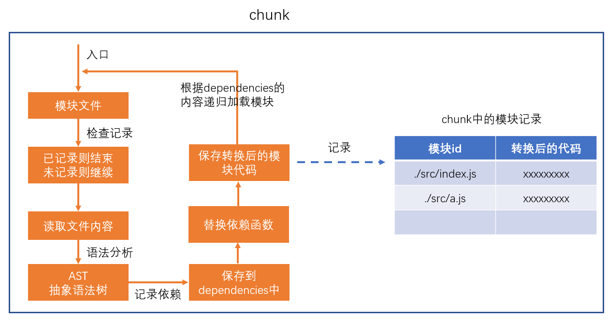

# loader

> webpack做的事情，仅仅是分析出各种模块的依赖关系，然后形成资源列表，最终打包生成到指定的文件中。
> 更多的功能需要借助webpack loaders和webpack plugins完成。

webpack loader： **loader本质上是一个函数，它的作用是将某个源码字符串转换成另一个源码字符串返回。**


loader函数的将在模块解析的过程中被调用，以得到最终的源码。

**全流程：**


**chunk中解析模块的流程：**



**chunk中解析模块的更详细流程：**


**处理loaders流程：**


**loader配置：**

**完整配置**

```js
module.exports = {
    module: { //针对模块的配置，目前版本只有两个配置，rules、noParse
        rules: [ //模块匹配规则，可以存在多个规则
            { //每个规则是一个对象
                test: /\.js$/, //匹配的模块正则
                use: [ //匹配到后应用的规则模块
                    {  //其中一个规则
                        loader: "模块路径", //loader模块的路径，该字符串会被放置到require中
                        options: { //向对应loader传递的额外参数
							changeStr:"未知数"
                        }
                    }
                ]
            }
        ]
    }
}
```

**简化配置**

```js
module.exports = {
    module: { //针对模块的配置，目前版本只有两个配置，rules、noParse
        rules: [ //模块匹配规则，可以存在多个规则
            { //每个规则是一个对象
                test: /\.js$/, //匹配的模块正则
                use: ["模块路径1", "模块路径2"]//loader模块的路径，该字符串会被放置到require中
            }
        ]
    }
}
```

**注意:**

1.**loaders本质是一个函数，将源代码从一个字符串转换为另一个字符串。**

2.**loaders中只能使用common.js规范，因为loaders是在webpack编译的时候被执行的，而webpack又是在node环境下执行的。**

3.**loaders的匹配规则是从上往下的，但是执行loaders的时候却是从最后开始往前的。**

4.**大多数开发场景下，我们不需要自己写loader,因为现在的webpack生态比较成熟，几乎99%都有解决方案**


# 案例

> 写一个loader,将index.js中的错误给替换掉

src/index.js

```js
变量 a=10;//这个是错误的，虽然可以打包，但是无法执行
```

根目录下/loaders/test-loader.js

```js
//使用loader-utils来获取在webpack.config中传递给loader的参数
const loaderUtils = require("loader-utils");

/**
 * 编写的loader函数
 * @param {*} sourceCode 源代码
 * @returns 处理后的源代码
 */
module.exports = function (sourceCode) {
  console.log("loader1执行了");
  const options = loaderUtils.getOptions(this); //获取loader的参数,参数存在webpack的this中，this太复杂，所以使用loaderUtils来获取
  console.log(options);
  const reg = new RegExp(options.changeVar, "g"); //将参数中的变量替换为var

  return sourceCode.replace(reg, "var");
};

```

webpack.config.js

```js
module.exports = {
  mode: "development",
  //应用loaders
  module: {
    //模块匹配规则,可以配置多个规则
    rules: [
      //规则1
      {
        test: /index\.js$/, //规则：正则表达式,符合的化，就会应用loader
        //匹配后,应用的规则模块
        use: [
          {
            loader: "./loaders/loader1", //模块路径,该字符串会被webpack放置在require()中
            //给loaders传递参数
            options: {
              changeVar: "变量",
            },
          },
        ],
      },
    ],
  },
};

//options还可以进行简写
module.exports = {
  mode: "development",
  //应用loaders
  module: {
    //模块匹配规则,可以配置多个规则
    rules: [
      //规则1
      {
        test: /index\.js$/, //规则：正则表达式,符合的化，就会应用loader
        //匹配后,应用的规则模块
        use: [
          {
            loader: "./loaders/loader1?changeVar: "变量",", //简写options
          },
        ],
      },
    ],
  },
};
```

# 案例2--loader的执行顺序

index.js

```js
require("./a");
console.log("我是index.js");
变量 a=10;
```

a.js

```js
console.log("我是a.js");
```

loader1.js和loader2.js和loader3.js

```js
module.exports = function (sourceCode) {
  console.log("loader1执行了");
  return sourceCode;
};

module.exports = function (sourceCode) {
  console.log("loader2执行了");
  return sourceCode;
};

module.exports = function (sourceCode) {
  console.log("loader3执行了");
  return sourceCode;
};

```

webpack.config.js

```js
module.exports = {
  mode: "development",
  //应用loaders
  module: {
    rules: [
      {
        test: /index\.js$/, 
        use: ["./loaders/loader1?changeVar=变量", "./loaders/loader2"],
      },
      //规则2
      {
        test: /\.js/,
        use: ["./loaders/loader3"],
      },
    ],
  },
};

```

**请问控制台输出什么?**

```js
答案:
/*
3
2
1
3
*/

//为什么?
/*
1.首先loader是从后往前执行的,而遇到符合的就会去执行loader
2.不输出index.js中的"我是index"是因为，loader只是在webpack编译的时候执行的，而代码不会被执行。
3.不理解的话就需要看上面的**chunk中解析模块的更详细流程图，一个chunk会到AST之前去判断是否符合loader的规则，并且AST分析出依赖的模块之后会递归所依赖的模块。
*/
```

