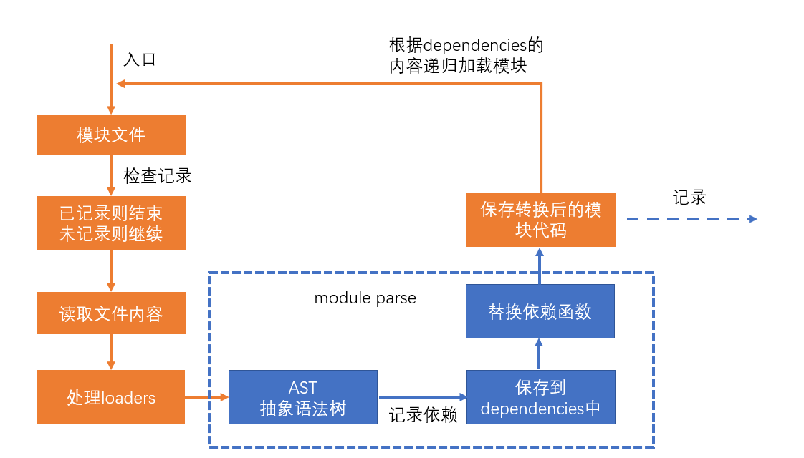

# 减少模块解析 {ignore}

## 什么叫做模块解析？



模块解析包括：抽象语法树分析、依赖分析、模块语法替换

## 不做模块解析会怎样？


如果某个模块不做解析，该模块经过 loader 处理后的代码就是最终代码。

如果没有 loader 对该模块进行处理，该模块的源码就是最终打包结果的代码。

如果不对某个模块进行解析，可以缩短构建时间

## 哪些模块不需要解析？

模块中无其他依赖：一些已经打包好的第三方库，比如 jquery(没有依赖任何第三方库),所以当解析到 jquery 的时候就不需要对 jquery 进行抽象语法树分析。

## 如何让某个模块不要解析？

配置`module.noParse`，它是一个正则，被正则匹配到的模块不会解析

webpack.config.js

```js
module.exports = {
  mode: "development",
  devtool: "source-map",
  module: {
    noParse: /jquery/, //正则表达式,匹配到的不进行AST抽象语法树分析，但是仍会将源码放置到打包结果中
  },
};
```

## 注意

当知道这个配置之后，不可以滥用，只有那些确实没有其它依赖的模块才可以进行不解析。
看下面这个例子：
:::code-group

```js [index.js]
import $ from "./test.js";
console.log($);
```

```js [test.js]
import $ from "jquery";
export default $;
```

```js [webpack.config.js]
module.exports = {
  mode: "development",
  devtool: "source-map",
  module: {
    noParse: /test.js/,
  },
};
```

:::

如果这样设置 test 模块不解析的话。
那么 webpack 在对 index.js 进行分析完，到 test 模块的时候,webpack 只会将 test 模块的代码原封不动的打包。不会再对 test 中的模块进行 AST 抽象语法分析，以及`__webpack__require()`函数替换,所以 test 中依赖的 jquery 不会被打包进最终结果。
