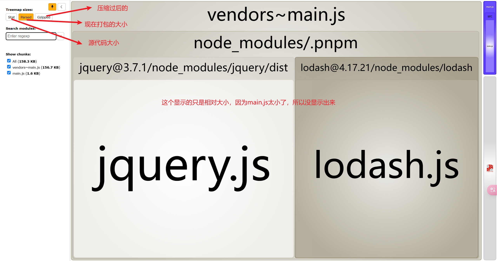

# Bundle Analyzer {ignore}

Bundle Analyzer 是一个 webpack 插件，用于分析打包后的文件，以可视化的形式展示出打包后的文件大小，并提供详细的打包分析报告。

## 使用

1.  安装依赖包

```sh
pnpm i webpack-bundle-analyzer -D;
```

2.  在 webpack 配置文件中添加如下代码

```js
const { CleanWebpackPlugin } = require("clean-webpack-plugin");
const WebpackBundleAnalyzer =
  require("webpack-bundle-analyzer").BundleAnalyzerPlugin;

module.exports = {
  mode: "production",
  plugins: [new CleanWebpackPlugin(), new WebpackBundleAnalyzer()],
};
```

打包完成之后，会自动弹出来一个分包的体积页面。


## 针对进行优化

经过分析我们想要进行对包体积进行优化,属于传输优化一类。

- 分包
- 优化 loadsh,对 lodash 进行 tree-shaking[使用 lodash-es]
- lodash 按需加载 [使用 import()]

:::code-group

```js [index.js]
import $ from "jquery";

$(".red").click(async function () {
  const { chunk } = await import("./utils");
  chunk([2, 3, 5, 46, 8, 2], 2);
});
```

```js [utils.js]
export { chunk } from "lodash-es";
```

```js [webpack.config.js]
const { CleanWebpackPlugin } = require("clean-webpack-plugin");
const WebpackBundleAnalyzer =
  require("webpack-bundle-analyzer").BundleAnalyzerPlugin;

module.exports = {
  mode: "production",
  //打开分包
  optimization: {
    splitChunks: {
      chunks: "all",
    },
  },
  plugins: [new CleanWebpackPlugin(), new WebpackBundleAnalyzer()],
};
```

```json [package.json]
{
  "name": "test",
  "version": "1.0.0",
  "description": "",
  "main": "index.js",
  "scripts": {
    "build": "npx webpack"
  },
  "author": "",
  "license": "ISC",
  "devDependencies": {
    "clean-webpack-plugin": "^3.0.0",
    "jquery": "^3.4.1",
    "lodash": "^4.17.15",
    "lodash-es": "^4.17.15",
    "webpack": "^4.41.6",
    "webpack-bundle-analyzer": "^3.6.0",
    "webpack-cli": "^3.3.11"
  }
}
```

:::
再次打包看看效果，此时我们发现，包体积已经明显变小了。
