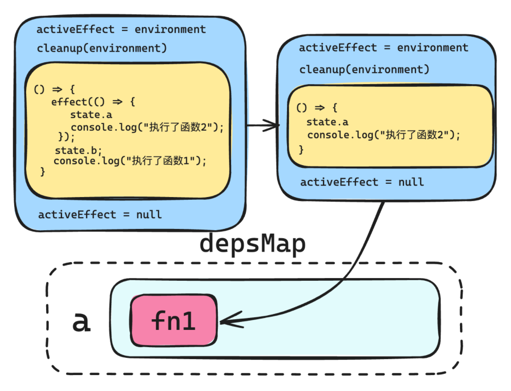

# 图解EFFECT

effect 方法的作用：就是将 **函数** 和 **数据** 关联起来。

## 回忆 watchEffect

```js
import { ref, watchEffect } from "vue";
const state = ref({ a: 1 });
const k = state.value;
const n = k.a;
// 这里就会整理出 state.value、state.value.a
watchEffect(() => {
  console.log("运行");
  state;
  state.value;
  state.value.a;
  n;
});
setTimeout(() => {
  state.value = { a: 3 }; // 要重新运行，因为是对 value 的写入操作
}, 500);
```


effect函数的设计：

## effect函数的设计：

```js
// 原始对象
const data = {
  a: 1,
  b: 2,
  c: 3,
};
// 产生一个代理对象
const state = new Proxy(data, { ... });
effect(() => {
  console.log(state.a);
});
```

在上面的代码中，向 effect 方法传入的回调函数中，访问了 state 的 a 成员，然后我们期望 a 这个成员和这个回调函数建立关联。

### 第一版实现

> 思路:
>
> * 我们希望有一个函数可以记录下来哪个函数依赖了哪个响应式属性，这个函数就是effet()
>
> * effect工作原理：
>
>   接收一个回调函数，该回调函数就是依赖了响应式属性的函数。
>
>   执行该回调函数，并缓存该回调函数。
>
> * 当收集依赖track执行时，用一个Map对象存放这些依赖了某个响应式属性的函数。[因为依赖某个属性的函数可能不止一个]
>
> * 当派发更新trigger时，我们从Map对象中取出这些依赖函数，并重新执行。

```js
//Map对象存放这些依赖函数
//key是依赖的响应式属性，value是Set集合,集合存放的就是一个个依赖该响应式属性key的函数
Map{
	key:Set[fn1,fn2]
}
```

简单实现:

```js
// 依赖收集
let activeEffect = null; //缓存需要被记录的函数
let depsMap = new Map(); //存放key和依赖的函数的映射
function track(target, key) {
  //   console.log("依赖收集--", key);
  if (activeEffect) {
    let deps = depsMap.get(key);
    if (!deps) {
      deps = new Set();
      depsMap.set(key, deps);
    }
    deps.add(activeEffect);
  }
  console.log(depsMap);
}
// 派发更新
function trigger(target, key) {
  //   console.log("派发更新--", key);
  //从Map中找到对应的key的依赖函数集合，然后执行
  let deps = depsMap.get(key);
  if (deps) {
    deps.forEach((depFn) => depFn());
  }
}

// 原始对象
const data = {
  a: 1,
  b: 2,
  c: 3,
};

// 代理
const state = new Proxy(data, {
  get(target, key) {
    track(target, key); // 进行依赖收集
    return target[key];
  },
  set(target, key, value) {
    target[key] = value;
    trigger(target, key); // 派发更新
    return true;
  },
});

/**effct函数:将函数和数据关联起来
 * @param {*} fn 回调函数
 */
function effect(fn) {
  activeEffect = fn;
  fn();
  activeEffect = null;
}

// 使用effect
effect(() => {
  console.log("执行函数");
  //回调函数依赖了state.a,我们期望a 这个成员和这个回调函数建立关联。
  console.log(state.a);
});

state.a = 10;

```

第一版实现，**每个属性对应一个 Set 集合**，该集合里面是所依赖的函数，所有属性与其对应的依赖函数集合形成一个 map 结构，如下图所示：


activeEffect 起到一个中间变量的作用，临时存储这个回调函数，等依赖收集完成后，再将这个临时变量设置为空即可。


#### **问题一**：每一次运行回调函数的时候，都应该确定新的依赖关系。

稍作修改：

```js
effect(() => {
  if (state.a === 1) {
    state.b;
  } else {
    state.c;
  }
  console.log("执行了函数");
});
state.a=2;//更新a的值
```

在上面的代码中，两次运行回调函数，所建立的依赖关系应该是不一样的：

- 第一次：a、b
- 第二次：a、c

第一次运行依赖如下：

```js
Map(1) { 'a' => Set(1) { [Function (anonymous)] } }
Map(2) {
  'a' => Set(1) { [Function (anonymous)] },
  'b' => Set(1) { [Function (anonymous)] }
}
执行了函数
```


执行 state.a = 100

依赖关系变为了：

```js
Map(1) { 'a' => Set(1) { [Function (anonymous)] } }
Map(2) {
  'a' => Set(1) { [Function (anonymous)] },
  'b' => Set(1) { [Function (anonymous)] }
}
执行了函数
Map(2) {
  'a' => Set(1) { [Function (anonymous)] },
  'b' => Set(1) { [Function (anonymous)] }
}
Map(2) {
  'a' => Set(1) { [Function (anonymous)] },
  'b' => Set(1) { [Function (anonymous)] }
}
执行了函数
```

当 a 的值修改为 100 后，依赖关系应该重新建立，也就是说：

- 第一次运行：建立 a、b 依赖
- 第二次运行：建立 a、c 依赖

那么现在 a 的值明明已经变成 100 了，为什么重新执行回调函数的时候，没有重新建立依赖呢？

原因也很简单，如下图所示：


**第一次建立依赖关系的时候，是将依赖函数赋值给 activeEffect，最终是通过 activeEffect 这个中间变量将依赖函数添加进依赖列表的**。依赖函数执行完毕后，activeEffect 就设置为了 null，之后 a 成员的值发生改变，重新运行的是回调函数，但是 activeEffect 的值依然是 null，这就会导致 track 中依赖收集的代码根本进不去：

```js
function track(target, key) {
  if (activeEffect) {
    // ...
  }
}
```

怎么办呢？也很简单，**我们在收集依赖的时候，不再是仅仅收集回调函数，而是收集一个包含 activeEffect 的环境**，继续改造 effect：

```js
function effect(fn) {
  const environment = () => {
    activeEffect = environment;
    fn();
    activeEffect = null;
  };
  environment();
}
```

这里 activeEffect 对应的值，不再是像之前那样是回调函数，而是一整个 environment 包含环境信息的函数，这样当重新执行依赖的函数的时候，执行的也就是这个环境函数，而环境函数的第一行就是 activeEffect 赋值，这样就能够正常的进入到依赖收集环节。

如下图所示：


#### **问题二：**旧的依赖没有删除

解决方案：

* 在执行 fn 方法之前，先调用了一个名为 cleanup 的方法，该方法的作用就是用来清除依赖。
* 给环境函数添加一个deps属性(数组),在track的时候将set集合的函数记录下来
* 在cleanup中,删除环境函数中记录的对应的集合函数,之后删除Map集合中的对应的依赖。

该方法代码如下：

```js
function track(target, key) {
   if (activeEffect) {
    let deps = depsMap.get(key);
    if (!deps) {
      deps = new Set();
      depsMap.set(key, deps);
    }
    deps.add(activeEffect);
   //新增+++ 将当前依赖的集合添加到环境函数中
    activeEffect.deps.push(deps); 
  }
}

function effect(fn) {
    //...
    //新增+++
   environment.deps = []; //+++给环境函数添加一个属性deps,用来记录该环境函数在哪些集合里
}

/**清理依赖 */
function cleanup(environment) {
  const depsArr = environment.deps; //拿到环境函数的依赖集合数组
  if (depsArr.length) {
    depsArr.forEach((dep) => {
      dep.delete(environment);//删除依赖中对应的环境函数
      if (dep.size === 0) {
        // 遍历Map中对应的依赖并删除
        for (const [key, value] of depsMap) {
          if (value === dep) {
            depsMap.delete(key);
          }
        }
      }
    });
  }
}
```

具体结构如下图所示：


#### **问题三：测试多个依赖函数**

```js
effect(() => {
  if (state.a === 1) {
    state.b;
  } else {
    state.c;
  }
  console.log("执行了函数1");
});
effect(() => {
  console.log(state.c);
  console.log("执行了函数2");
});
state.a = 2;
```

```js
effect(() => {
  if (state.a === 1) {
    state.b;
  } else {
    state.c;
  }
  console.log("执行了函数1");
});
effect(() => {
  console.log(state.a);
  console.log(state.c);
  console.log("执行了函数2");
});
state.a = 2;
```

循环产生的原因:

1. 当执行完effect函数之后，最初的依赖已经被记录了。
2. 此时修改state.a=2就会触发trigger,根据下图分析可知，当执行一次env1就会重新产生一个env1的依赖。depsMap中就会多加一个依赖。
3. 而trigger函数中`const deps=depsMap.get(key)`deps是对depsMap某个属性的引用。当引用改变，deps也在改变。即depsMap不停的再添加依赖，所以deps也在不停的更改。
4. 当deps不停的添加依赖，所以在执行的时候，就形成了循环。

总结就是：**因为一直在删除依赖又添加依赖，导致原来的Set的foreach函数一直没结束。**


解决无限循环问题：

找到问题之后，我们就可以在执行前将deps做一个快照，之后不论怎么修改deps，也不会影响我们的执行。

```js
function trigger(target, key) {
  const deps = depsMap.get(key);
  if (deps) {
    const effectsToRun = new Set(deps); // 复制一份集合，防止在执行过程中修改原集合
    effectsToRun.forEach((effect) => effect());
  }
}
```


#### **问题四：测试嵌套函数**

```js
effect(() => {
  effect(() => {
    state.a
    console.log("执行了函数2");
  });
  state.b;
  console.log("执行了函数1");
});
```

会发现所建立的依赖又不正常了：

```js
Map(1) { 'a' => Set(1) { [Function: environment] { deps: [Array] } } }
执行了函数2
Map(1) { 'a' => Set(1) { [Function: environment] { deps: [Array] } } }
执行了函数1
```

**原因分析：**

是目前的函数栈有问题，当执行到内部的 effect 函数时，会将 activeEffect 设置为 null，导致嵌套函数之后所有的依赖收集都会卡在track函数的`if(acctiveEffect)`判断处。

如下图所示：



**解决方案**：模拟函数栈的形式。

```js
const effectStatck = []; //模拟函数栈
function effect(fn) {
  // 收集activeEffect所处于的环境,利用闭包的原理，记录下了当前的fn
  const environment = () => {
    activeEffect = environment;
    effectStatck.push(environment); //+++将环境函数推入栈，其实就在模拟真实的函数栈
    cleanup(environment); //清理环境函数下的依赖
    fn();
    // activeEffect = null;//- - -
    effectStatck.pop(); //+++
    activeEffect = effectStatck[effectStatck.length - 1]; //+++
  };
  environment.deps = []; //给环境函数添加一个属性deps,用来记录该环境函数在哪些集合里
  environment();
}
```

## effect完整代码

```js
// 数据
const data = {
  a: 1,
  b: 2,
  c: 3,
};

// 代理
const state = new Proxy(data, {
  get(target, key) {
    track(target, key); // 进行依赖收集
    return target[key];
  },
  set(target, key, value) {
    target[key] = value;
    trigger(target, key); // 派发更新
    return true;
  },
});

// 依赖搜集
let activeEffect = null; //缓存当前的函数
let depsMap = new Map(); //存储所有属性的函数
let effectStatck = []; //模拟真实的函数栈，解决嵌套依赖记录错误问题。
function track(target, key) {
  console.log("依赖收集--", key);
  if (activeEffect) {
    let deps = depsMap.get(key);
    if (!deps) {
      deps = new Set();
      depsMap.set(key, deps);
    }
    deps.add(activeEffect);
    activeEffect.deps.push(deps); //记录当前环境函数下所有的依赖
    console.log("activeEffect.deps", activeEffect.deps);
  }
  console.log("依赖Map", depsMap);
}

// 派发更新
function trigger(target, key) {
  console.log("派发更新--", key);
  const deps = depsMap.get(key);
  if (deps) {
    const depsToRun = new Set(deps);
    depsToRun.forEach((fn) => {
      fn();
    });
  }
}

// effect
function effect(fn) {
  const environment = () => {
    activeEffect = environment;
    effectStatck.push(environment); //将函数推入栈中，其实就在模拟真实的函数栈
    cleanUp(environment); //每次搜集前清理依赖
    fn();
    // activeEffect = null; 执行完不能设置为null了，会导致嵌套后的依赖无法收集
    effectStatck.pop();
    activeEffect = effectStatck[effectStatck.length - 1];
  };
  environment.deps = []; //记录当前环境下的所有依赖
  environment();
}
/**清理依赖 */
function cleanUp(env) {
  const depSets = env.deps; //拿出当前环境下的所有依赖
  depSets.forEach((depSet) => {
    depSet.delete(env);
    if (depSet.size === 0) {
      for (const [key, value] of depsMap) {
        if (value === depSet) {
          depsMap.delete(key);
        }
      }
    }
  });
}

//
effect(() => {
  effect(() => {
    state.a;
    console.log("执行了函数2");
  });
  state.b;
  console.log("执行了函数1");
});

```

---

-EOF-

