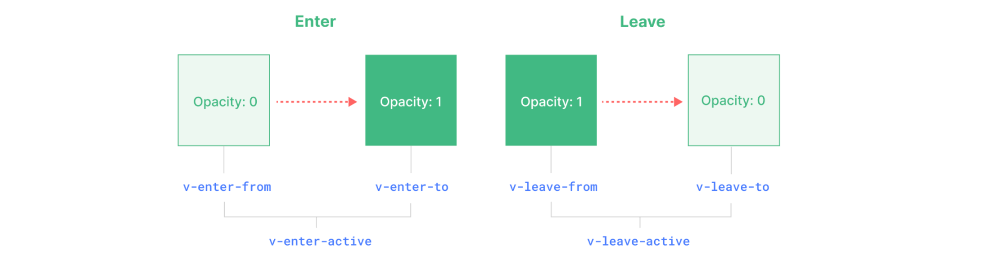

# Transition

Transition 是 Vue 提供的一个内置组件，作用：会在一个元素或组件**进入**和**离开** DOM 时应用动画。

在 Web 应用中，有一个很常见的需求，就是针对元素的进入或者离开应用动画。

不用 Transition 组件行不行？

当然可以。

## 1.使用原生 css3 过渡

1. 不用 Transition 代码示例

   ```vue
   <template>
     <div>
       <button @click="show = !show">切换</button>
       <div :class="['fade', { active: show, leave: !show }]">
         <h1>动画</h1>
         <p>淡入淡出</p>
       </div>
     </div>
   </template>

   <script setup>
   import { ref } from "vue";
   const show = ref(true);
   </script>

   <style scoped>
   .fade {
     transition: 1s;
   }

   .active {
     opacity: 1;
   }

   .leave {
     opacity: 0;
   }
   </style>
   ```

## 2.使用 Transition

1. 使用 Transition 代码示例

   ```vue
   <template>
     <div>
       <button @click="show = !show">切换</button>
       <div :class="['fade', { active: show, leave: !show }]">
         <h1>动画</h1>
         <p>淡入淡出</p>
       </div>
       <Transition>
         <div v-if="show">
           <h1>动画</h1>
           <p>淡入淡出</p>
         </div>
       </Transition>
     </div>
   </template>

   <script setup>
   import { ref } from "vue";
   const show = ref(true);
   </script>

   <style scoped>
   .v-enter-active,
   .v-leave-active {
     transition: opacity 1s;
   }

   .v-enter-from,
   .v-leave-to {
     opacity: 0;
   }

   .v-enter-to,
   .v-leave-from {
     opacity: 1;
   }
   </style>
   ```

思考 🤔：使用 Transition 带来的好处是什么？

使用 Transition，它会自动的控制一组特定样式类的挂载和移除，这样的话模板就会清爽很多。但是对应的样式类还是要自己来写，因为 Vue 无法预知你要如何进入和离开，它只负责在特定时间挂载和移除样式类。

Transition 样式类有 6 个，分别对应两大阶段：



1. 进入

   - v-enter-from :元素插入前挂载
   - v-enter-to ：元素插入后挂载
   - v-enter-active ：元素插入前后一直存在

2. 离开

   - v-leave-from :元素离开前挂载
   - v-leave-to :元素离开后挂载
   - v-leave-active ：元素离开前后一直存在

   以上所有类名都会在过渡执行完之后被移除

以进入为例，Vue 会在元素**插入之前**，自动的挂上 v-enter-from 以及 v-enter-active 类，类似于：

```html
<div v-if="show" class="v-enter-from v-enter-active">
  <h1>动画</h1>
  <p>淡入淡出</p>
</div>
```

**元素插入完成后**，会移除 v-enter-from 样式类，然后插入 v-enter-to，类似于：

```vue
<div v-if="show" class="v-enter-to v-enter-active">
  <h1>动画</h1>
  <p>淡入淡出</p>
</div>
```

**也就是说，整个从插入前到插入后，v-enter-active 样式类是一直有的，不过插入前会挂载 v-enter-from，插入后会挂载 v-enter-to**

而这 3 个样式类所对应的样式分别是：

- v-enter-from：opacity: 0;
- v-enter-to：opacity: 1;
- v-enter-active：transition: opacity 3s;

这就自然出现了淡入淡出的效果。**当整个过渡效果结束后，这 3 个辅助样式类会一并被移除掉**。

## **其他相关细节**

### **1. 过渡效果命名**

假设 Transition 传递了 name 属性，那么就不会以 v 作为前缀，而是以 name 作为前缀：

```vue
<Transition name="fade">
  ...
</Transition>
```

- fade-enter-from
- fade-enter-to
- fade-enter-active

另外还可以直接指定过渡的类是什么，可以传递这些 props 来指定自定义 class：

- enter-from-class //指定进入前的效果为哪个类名
- enter-active-class
- enter-to-class
- leave-from-class
- leave-active-class
- leave-to-class

### **2. 搭配 animation**

也可以搭配 CSS 的 animation 来使用，这个时候只需要简单的在 \*-enter/leave-active 样式类下使用动画即可。

```vue
<template>
  <div>
    <button @click="show = !show">切换</button>
    <Transition name="bounce">
      <div v-if="show">
        <h1>动画</h1>
        <p>淡入淡出</p>
      </div>
    </Transition>
  </div>
</template>

<script setup>
import { ref } from "vue";
const show = ref(true);
</script>

<style scoped>
//只需要将 `**-**-active` 指定动画即可
.bounce-enter-active {
  animation: bounce-in 1s;
}

.bounce-leave-active {
  animation: bounce-in 1s reverse;
}

@keyframes bounce-in {
  0% {
    transform: scale(0);
  }
  50% {
    transform: scale(1.5);
  }
  100% {
    transform: scale(1);
  }
}
</style>
```

### **3. 常用 props 属性**

1. appear：在初始渲染时就应用过渡

2. mode：用于指定过渡模式，可选值有

   - in-out：新元素先执行过渡，旧元素等待新元素过渡完成后再离开
   - out-in：旧元素先执行过渡，旧元素过渡完成后新元素再进入

```vue
<template>
  <div>
    <button @click="show = !show">切换</button>
    <Transition name="bounce" mode="in-out">
      <div v-if="show" style="text-align: center">
        <h1>动画</h1>
        <p>淡入淡出</p>
      </div>
      <div v-else style="text-align: center">
        <h1>222</h1>
        <p>淡入淡出</p>
      </div>
    </Transition>
  </div>
</template>

<script setup>
import { ref } from "vue";
const show = ref(true);
</script>

<style scoped>
.bounce-enter-active {
  animation: bounce-in 0.5s;
}

.bounce-leave-active {
  animation: bounce-in 0.5s reverse;
}

@keyframes bounce-in {
  0% {
    transform: scale(0);
  }
  50% {
    transform: scale(1.5);
  }
  100% {
    transform: scale(1);
  }
}
</style>
```

### **4. 使用 key**

有些时候会存在这么一种情况，就是不存在元素的进入和离开，仅仅是文本节点的更新，此时就不会发生过渡。

要解决这种情况也很简单，添加上 key 即可。

> 如果不使用 `key` attribute，则只有文本节点会被更新，因此不会发生过渡。但是，有了 `key` 属性，Vue 就知道在 `msg` 改变时创建一个新的 `p` 元素，因此 `Transition` 组件有两个不同的元素在它们之间进行过渡。
>
> 即新创建了一个`p`与原先的`p`进行过渡,本质上还是元素的显示和隐藏

```vue
<template>
  <div>
    <button @click="show = !show">切换</button>
    <Transition name="fade" mode="out-in">
      <p :key="message">{{ message }}</p>
    </Transition>
  </div>
</template>

<script setup>
import { ref, computed } from "vue";
const show = ref(true);
const message = computed(() => {
  return show.value ? "Hello" : "World";
});
</script>

<style scoped>
.fade-enter-active,
.fade-leave-active {
  transition: opacity 1s;
}

.fade-enter-from,
.fade-leave-to {
  opacity: 0;
}

.fade-enter-to,
.fade-leave-from {
  opacity: 1;
}
</style>
```

## **实战案例**

图片切换:

点击下一张，旧图片淡出，新图片从右平移进来

点击上一张，旧图片淡出，新图片从左平移进来

```vue
<template>
  <div class="container">
    <div class="btns">
      <button @click="prevFn">上一张</button>
      <button @click="nextFn">下一张</button>
    </div>
    <Transition :name="`${direction}`">
      
    </Transition>
  </div>
</template>

<script setup>
import { ref, computed } from "vue";
//图片数组
const imgArr = [
  "https://10.idqqimg.com/eth/ajNVdqHZLLAJib8odhz8Th2Z4Gat0axooYaxANJlaLEwTomre0hx8Y5yib6FxDZxsgiaYG1W2ETbrU/130?tp=webp",
  "https://10.idqqimg.com/eth/ajNVdqHZLLDqYf0PtFibF9JNOnRbAw7DicWPicmfRkQwPeK2mnZ7ZJzZFdsCwCWdcwhEqoVphXiaDHE/130?tp=webp",
  "https://thirdqq.qlogo.cn/g?b=sdk&k=LaERpMuX1ZjWTQmhrhst6Q&s=100&t=0&tp=webp",
  "https://10.idqqimg.com/eth/ajNVdqHZLLDXIjdTYsqbfkxiaibd3lYGEgfiaEwficYfK2ogZDicCxaKibVibGA2Cj2ltgOvCm1tbRs1iac/130?tp=webp",
  "https://thirdqq.qlogo.cn/g?b=sdk&k=pfIficic6WRliaLULZudVI5Tw&s=640&t=1600139160&tp=webp",
];

//img的索引
const imgIndex = ref(0);

//当前的img地址
const current = computed(() => {
  return imgArr[imgIndex.value];
});
//方向
const direction = ref("next");
const nextFn = () => {
  imgIndex.value++;
  if (imgIndex.value >= imgArr.length) {
    imgIndex.value = 0;
  }
  direction.value = "next";
};

const prevFn = () => {
  imgIndex.value--;
  if (imgIndex.value < 0) {
    imgIndex.value = imgArr.length - 1;
  }
  direction.value = "prev";
};
</script>

<style scoped>
.container {
  text-align: center;
}
.avatar {
  width: 200px;
  height: 200px;
  border-radius: 50%;
  position: absolute;
  left: 50%;
  margin-left: -100px;
  top: 100px;
}

.btns button {
  margin: 1em 0.5em;
}

/* 切换图片 */
.next-enter-active,
.next-leave-active,
.prev-enter-active,
.prev-leave-active {
  transition: all 0.5s;
}

.next-enter-from,
.next-leave-to,
.prev-enter-from,
.prev-leave-to {
  opacity: 0;
}

.next-enter-from {
  transform: translateX(200px);
}

.prev-enter-from {
  transform: translateX(-200px);
}
</style>
```

## **JS 钩子**

除了通过 CSS 来实现动画，常见的实现动画的方式还有就是 JS. Transition 组件也支持 JS 钩子的写法：

```vue
<Transition
  @before-enter="onBeforeEnter"
  @enter="onEnter"
  @after-enter="onAfterEnter"
  @enter-cancelled="onEnterCancelled"
  @before-leave="onBeforeLeave"
  @leave="onLeave"
  @after-leave="onAfterLeave"
  @leave-cancelled="onLeaveCancelled"
>
  <!-- ... -->
</Transition>

<script setup>
const onEnter = (el, done) => {
  // ...
};
</script>
```

done 方法的作用如下：

1. 通知 Vue 过渡完成：在执行完自定义的进入或离开动画后，调用 done 方法告诉 Vue 当前过渡已完成，从而允许 Vue 继续处理 DOM 更新。
2. 处理异步操作：如果在过渡期间需要进行异步操作（例如等待数据加载或执行网络请求），可以在异步操作完成后调用 done 方法。

示例如下：

```vue
<template>
  <div class="container">
    <div class="btns">
      <button @click="show = !show">切换</button>
    </div>
    <!-- 之前是在特定的时间挂对应的 CSS 样式类 -->
    <!-- 现在是在特定的时间触发事件处理函数 -->
    <Transition @before-enter="beforeEnter" @enter="enter" @leave="leave">
      <p v-if="show" class="box">Hello World</p>
    </Transition>
  </div>
</template>

<script setup>
import { ref } from "vue";
const show = ref(true);

function beforeEnter(el) {
  // 在元素进入之前，设置初始样式
  el.style.opacity = 0;
  el.style.transform = "translateY(-20px)";
}

function enter(el, done) {
  // 这里设置 setTimeout 是为了让浏览器有时间应用初始样式
  // 将这个函数推到下一个事件循环中执行
  // 避免初始样式和目标样式在同一帧中执行
  setTimeout(() => {
    el.style.transition = "all 1s";
    el.style.opacity = 1;
    el.style.transform = "translateY(0)";
    done();
  }, 0);
}

function leave(el, done) {
  // 因为元素已经在文档中了，直接设置样式即可
  el.style.transition = "all 1s";
  el.style.opacity = 0;
  el.style.transform = "translateY(-20px)";
  // 这里的 setTimeout 是为了让动画执行完毕后再调用 done
  // 保证和过渡时间一致
  setTimeout(() => {
    done();
  }, 1000);
}
</script>

<style scoped>
.container {
  text-align: center;
}
.btns button {
  margin: 1em 0.5em;
}
.box {
  width: 200px;
  height: 50px;
  background-color: #42b983;
  color: white;
  display: flex;
  justify-content: center;
  align-items: center;
  margin: 20px auto;
}
</style>
```

相比前面纯 CSS 的方式，JS 钩子在动画控制方面会更加灵活:

1. 精确控制过渡效果
2. 处理异步操作
3. 动态计算和条件逻辑
4. 与第三方库集成

---

-EOF-
