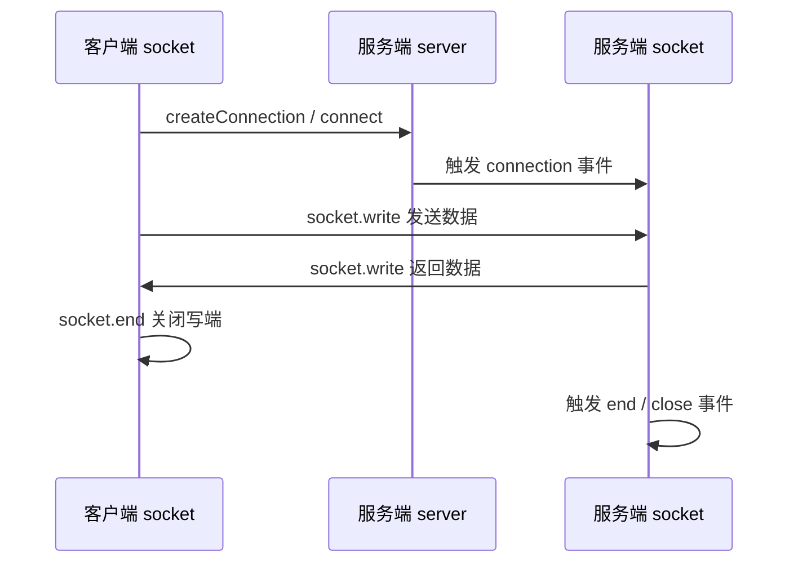

# Node.js Net 模块 —— TCP/IP 网络通信

---

## 一、模块概述

`net` 是一个通信模块，利用它，可以实现：

- **进程间通信（IPC）**
- **网络通信（TCP/IP）**

`net` 属于最原生的模块，写法比较偏向网络最原始的层面，很多场景实现起来比较麻烦。

`net` 模块是底层网络通信模块，提供了 **TCP/IP 协议** 的实现。`**http` 模块基于 `net` 模块实现。

`net` 可以实现：

- 开启**客户端**，去请求资源
- 开启**服务端**，监听端口，返回资源

> 由于 `net` 工作在 TCP 层，HTTP 请求/响应需要**手动拼接协议格式**（请求头、响应头、消息体等），这也是理解 HTTP 底层原理的好方式。

---

## 二、创建客户端

```js
net.createConnection(options, connectListener); //返回socket
// 等价写法
net.connect(options, connectListener);
```


**返回：socket：**

socket 是一个特殊的文件，是每次建立链接都会创建的一个文件。

在 node 中表现为一个双工流对象，通过向流写入内容发送数据，通过监听流的内容获取数据。

### 2.1 基本使用

```js
const net = require("net");

const socket = net.createConnection(
  {
    host: "duyi.ke.qq.com",
    port: 80,
  },
  () => {
    console.log("连接成功");
  },
);
```

### 2.2 连接配置项速查表

| 配置项         | 类型     | 说明                           |
| -------------- | -------- | ------------------------------ |
| `host`         | `string` | 目标主机名或 IP 地址           |
| `port`         | `number` | 目标端口号                     |
| `path`         | `string` | Unix Domain Socket 路径（IPC） |
| `localAddress` | `string` | 本地绑定地址                   |
| `localPort`    | `number` | 本地绑定端口                   |

### 2.3 客户端 Socket —— 事件速查表

| 事件名    | 触发时机                      | 回调参数          |
| --------- | ----------------------------- | ----------------- |
| `connect` | 与服务器建立连接成功时        | 无                |
| `data`    | 收到服务器数据时              | `chunk`（数据块） |
| `end`     | 对方调用 `end()` 关闭写端时   | 无                |
| `close`   | 连接完全关闭时                | 无                |
| `error`   | 连接过程中出错时              | `err`（错误对象） |
| `timeout` | 连接超时（需先 `setTimeout`） | 无                |

### 2.4 客户端 Socket —— 方法速查表

| 方法                           | 说明                                               |
| ------------------------------ | -------------------------------------------------- |
| `socket.write(data)`           | 向服务器发送数据，可多次调用                       |
| `socket.end([data])`           | 发送最后一块数据（可选）并关闭连接的写端           |
| `socket.destroy()`             | 立即销毁连接                                       |
| `socket.setEncoding(encoding)` | 设置编码，如 `"utf-8"`，之后 `data` 事件收到字符串 |

---

## 三、创建服务端

```js
net.createServer([options], connectionListener);
```

### 3.1 基本使用

```js
const net = require("net");

const server = net.createServer();

server.listen(9527);

server.on("listening", () => {
  console.log("server listen 9527");
});

server.on("connection", (socket) => {
  console.log("有客户端连接到服务器");
});
```


### 3.2 服务端 —— 事件速查表

| 事件名       | 触发时机           | 回调参数                   |
| ------------ | ------------------ | -------------------------- |
| `listening`  | 开始监听端口时     | 无                         |
| `connection` | 有新的客户端连接时 | `socket`（客户端连接对象） |
| `close`      | 服务器关闭时       | 无                         |
| `error`      | 服务器出错时       | `err`（错误对象）          |

### 3.3 服务端 —— 方法速查表

| 方法                          | 说明                               |
| ----------------------------- | ---------------------------------- |
| `server.listen(port[, host])` | 监听指定端口（可选指定主机）       |
| `server.close([callback])`    | 停止接受新连接，关闭已有连接后回调 |
| `server.address()`            | 返回 `{ port, family, address }`   |

### 3.4 连接 Socket（服务端侧）—— 事件速查表

每个客户端连接都会得到一个 `socket` 对象，事件与客户端侧基本一致：

| 事件名  | 触发时机         | 回调参数          |
| ------- | ---------------- | ----------------- |
| `data`  | 收到客户端数据时 | `chunk`（数据块） |
| `end`   | 客户端关闭写端时 | 无                |
| `close` | 连接完全关闭时   | 无                |
| `error` | 连接出错时       | `err`（错误对象） |

### 3.5 连接 Socket（服务端侧）—— 方法速查表

| 方法                 | 说明                                     |
| -------------------- | ---------------------------------------- |
| `socket.write(data)` | 向客户端发送数据                         |
| `socket.end([data])` | 发送最后一块数据（可选）并关闭连接的写端 |

---

## 四、TCP 通信流程



---

## 五、最佳实践

### 5.1 客户端 —— 手动发送 HTTP 请求

通过 `net` 连接 80 端口，手动拼接 HTTP/1.1 请求报文，向服务器获取网页内容。

**核心思路：**

1. 使用 `net.createConnection` 连接目标主机和端口
2. 连接成功后，用 `socket.write` 发送 HTTP 请求字符串
3. 监听 `data` 事件，逐块接收响应数据
4. 解析响应头，根据 `Content-Length` 判断消息体是否接收完毕
5. 接收完成后调用 `socket.end()` 关闭连接

:::code-group

```js [客户端.js]
const net = require("net");
const socket = net.createConnection(
  {
    host: "duyi.ke.qq.com",
    port: 80,
  },
  () => {
    console.log("连接成功");
  },
);

var receive = null;

/**
 * 提炼出响应字符串的消息头和消息体
 * @param {*} response
 */
function parseResponse(response) {
  const index = response.indexOf("\r\n\r\n");
  const head = response.substring(0, index);
  const body = response.substring(index + 2);
  const headParts = head.split("\r\n");
  const headerArray = headParts.slice(1).map((str) => {
    return str.split(":").map((s) => s.trim());
  });
  const header = headerArray.reduce((a, b) => {
    a[b[0]] = b[1];
    return a;
  }, {});
  return {
    header,
    body: body.trimStart(),
  };
}

function isOver() {
  // 需要接收的消息体的总字节数
  const contentLength = +receive.header["Content-Length"];
  const curReceivedLength = Buffer.from(receive.body, "utf-8").byteLength;
  console.log(contentLength, curReceivedLength);
  return curReceivedLength > contentLength;
}

socket.on("data", (chunk) => {
  const response = chunk.toString("utf-8");
  if (!receive) {
    // 第一次
    receive = parseResponse(response);
    if (isOver()) {
      socket.end();
    }
    return;
  }
  receive.body += response;
  if (isOver()) {
    socket.end();
    return;
  }
});

socket.write(`GET / HTTP/1.1
Host: duyi.ke.qq.com
Connection: keep-alive

`);

socket.on("close", () => {
  console.log(receive.body);
  console.log("结束了！");
});
```

```js [服务端.js]
const net = require("net");
const server = net.createServer();
const fs = require("fs");
const path = require("path");

server.listen(9527); // 服务器监听 9527 端口

server.on("listening", () => {
  console.log("server listen 9527");
});

server.on("connection", (socket) => {
  console.log("有客户端连接到服务器");

  socket.on("data", async (chunk) => {
    // console.log(chunk.toString("utf-8"));
    const filename = path.resolve(__dirname, "./hsq.jpg");
    const bodyBuffer = await fs.promises.readFile(filename);
    const headBuffer = Buffer.from(
      `HTTP/1.1 200 OK
Content-Type: image/jpeg

`,
      "utf-8",
    );
    const result = Buffer.concat([headBuffer, bodyBuffer]);
    socket.write(result);
    socket.end();
  });

  socket.on("end", () => {
    console.log("连接关闭了");
  });
});
```

:::

### 5.2 服务端 —— 手动返回 HTTP 响应

通过 `net.createServer` 创建 TCP 服务器，监听端口，收到请求后手动拼接 HTTP 响应报文返回图片资源。

**核心思路：**

1. 使用 `net.createServer()` 创建服务器，`server.listen(port)` 监听端口
2. 监听 `connection` 事件，每个连接对应一个 `socket`
3. 监听 `socket` 的 `data` 事件，收到客户端请求后读取本地文件
4. 手动拼接 HTTP 响应头 + 文件内容（Buffer），通过 `socket.write` 发送
5. 调用 `socket.end()` 关闭连接

> **HTTP 报文格式要点：**
>
> - 请求/响应头与消息体之间用 `\r\n\r\n` 分隔
> - 响应头需包含 `Content-Type` 等字段
> - 二进制文件（如图片）应使用 Buffer 拼接，避免编码问题

### 5.3 net 与 http 模块的关系

| 对比项   | `net` 模块                         | `http` 模块                         |
| -------- | ---------------------------------- | ----------------------------------- |
| 协议层   | TCP/IP 原始层                      | 基于 `net`，封装了 HTTP 协议        |
| 报文处理 | 需手动拼接请求/响应字符串          | 自动解析请求头、响应头              |
| 使用场景 | 理解底层原理、自定义协议通信       | 日常 Web 服务开发                   |
| 典型 API | `createConnection`、`createServer` | `http.request`、`http.createServer` |
