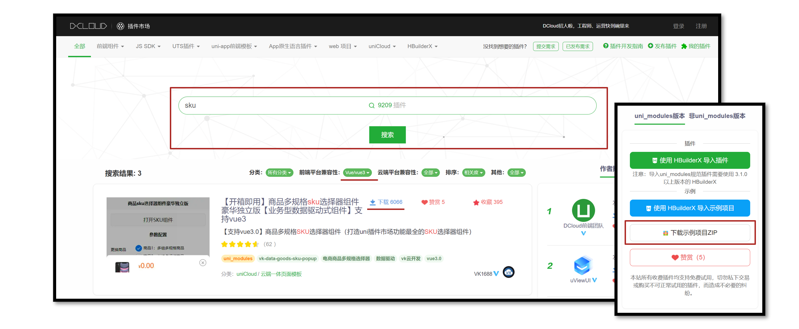

# 小兔鲜儿 - SKU 模块

学会使用[插件市场](https://ext.dcloud.net.cn/)，下载并使用 `SKU` 组件，实现**商品详情页**规格展示和交互。

## 存货单位（SKU）

**SKU 概念**

存货单位（Stock Keeping Unit），库存管理的最小可用单元，通常称为“单品”。

`SKU` 常见于电商领域，对于前端工程师而言，更多关注 [SKU 算法](https://juejin.cn/post/7002746459456176158) 和 **用户交互体验**。

## 插件市场

[uni-app 插件市场](https://ext.dcloud.net.cn/)，是 uni-app 官方插件生态集中地。

`SKU` 属于电商常见业务，插件市场有现成的 `SKU` 插件，我们下载并在项目中使用。



### 下载 SKU 插件

经过综合评估，我们选择该[SKU 插件](https://ext.dcloud.net.cn/plugin?id=2848)，请下载插件到本地。

**体验地址**


::: tip 常见问题

Q：如何评估第三方插件的质量？

A：查看插件的**评分、评价、下载量、更新频率以及文档完整性**，以确保插件具有良好的社区口碑、兼容性、性能和维护状况。

:::

### 使用 SKU 插件

**组件安装到自己项目**

1. 复制 `vk-data-goods-sku-popup` 和 `vk-data-input-number-box` 到项目的根 `components` 目录下。
2. 复制例子代码并运行体验。

**插件文档(部分)**

Props 参数

|   Props   |                     说明                      |  类型   | 默认值 |   可选值    |
| :-------: | :-------------------------------------------: | :-----: | :----: | :---------: |
|  v-model  |  双向绑定，true 为打开组件，false 为关闭组件  | Boolean | false  | true、false |
|   mode    | 模式 1:都显示 2:只显示购物车 3:只显示立即购买 | Number  |   1    |   1、2、3   |
| localdata |              商品信息本地数据源               | Object  |   -    |      -      |

Event 事件名

|  Event   |                    说明                     |            回调参数             |
| :------: | :-----------------------------------------: | :-----------------------------: |
| add-cart | 点击添加到购物车时（需选择完 SKU 才会触发） | selectShop：当前选择的 sku 数据 |
| buy-now  |   点击立即购买时（需选择完 SKU 才会触发）   | selectShop：当前选择的 sku 数据 |
|   open   |                 打开组件时                  |                -                |
|  close   |                 关闭组件时                  |                -                |

::: tip 常见问题

Q：为什么插件使用时无需导入？

A：`pages.json` 的 `easycom` 配置中，默认自动扫描 `xxx/xxx.vue` 格式的组件，**实现自动导入**。

Q：为什么组件代码 Git 提交时报错？

A：插件未采用 `eslint` 校验代码，请在插件源文件中添加 `/* eslint-disable */`，禁用 `eslint`。

:::

在 `vk-data-goods-sku-popup.vue` 和 `vk-data-input-number-box.vue` 组件禁用 `eslint`。

```vue {2}
<script>
/* eslint-disable */
// 省略组件源代码
</script>
```

温馨提示: 插件的作者已合并 [`eslint-disable` PR](https://gitee.com/vk-uni/vk-u-goods-sku-popup/commit/e114364dd7166be5f66f3ee893d8b32efafa417b) ，现在已无需手动添加该注释。

## 插件类型问题

尽管该插件未采用 TS 开发，但作者提供了详细的[插件文档](https://ext.dcloud.net.cn/plugin?id=2848)，我们可以依据文档为插件添加 TS 类型声明文件，从而提高项目数据校验的安全性。

### 类型声明文件

`vk-data-goods-sku-popup.d.ts`

```ts
import { Component } from '@uni-helper/uni-app-types'

/** SKU 弹出层 */
export type SkuPopup = Component<SkuPopupProps>

/** SKU 弹出层实例 */
export type SkuPopupInstanceType = InstanceType<SkuPopup>

/** SKU 弹出层属性 */
export type SkuPopupProps = {
  /** 双向绑定，true 为打开组件，false 为关闭组件 */
  modelValue: boolean
  /** 商品信息本地数据源 */
  localdata: SkuPopupLocaldata
  /** 按钮模式 1:都显示 2:只显示购物车 3:只显示立即购买 */
  mode?: 1 | 2 | 3
  /** 该商品已抢完时的按钮文字 */
  noStockText?: string
  /** 库存文字 */
  stockText?: string
  /** 点击遮罩是否关闭组件 */
  maskCloseAble?: boolean
  /** 顶部圆角值 */
  borderRadius?: string | number
  /** 最小购买数量 */
  minBuyNum?: number
  /** 最大购买数量 */
  maxBuyNum?: number
  /** 每次点击后的数量 */
  stepBuyNum?: number
  /** 是否只能输入 step 的倍数 */
  stepStrictly?: boolean
  /** 是否隐藏库存的显示 */
  hideStock?: false
  /** 主题风格 */
  theme?: 'default' | 'red-black' | 'black-white' | 'coffee' | 'green'
  /** 默认金额会除以100（即100=1元），若设置为0，则不会除以100（即1=1元） */
  amountType?: 1 | 0
  /** 自定义获取商品信息的函数（已知支付宝不支持，支付宝请改用localdata属性） */
  customAction?: () => void
  /** 是否显示右上角关闭按钮 */
  showClose?: boolean
  /** 关闭按钮的图片地址 */
  closeImage?: string
  /** 价格的字体颜色 */
  priceColor?: string
  /** 立即购买 - 按钮的文字 */
  buyNowText?: string
  /** 立即购买 - 按钮的字体颜色 */
  buyNowColor?: string
  /** 立即购买 - 按钮的背景颜色 */
  buyNowBackgroundColor?: string
  /** 加入购物车 - 按钮的文字 */
  addCartText?: string
  /** 加入购物车 - 按钮的字体颜色 */
  addCartColor?: string
  /** 加入购物车 - 按钮的背景颜色 */
  addCartBackgroundColor?: string
  /** 商品缩略图背景颜色 */
  goodsThumbBackgroundColor?: string
  /** 样式 - 不可点击时,按钮的样式 */
  disableStyle?: object
  /** 样式 - 按钮点击时的样式 */
  activedStyle?: object
  /** 样式 - 按钮常态的样式 */
  btnStyle?: object
  /** 字段名 - 商品表id的字段名 */
  goodsIdName?: string
  /** 字段名 - sku表id的字段名 */
  skuIdName?: string
  /** 字段名 - 商品对应的sku列表的字段名 */
  skuListName?: string
  /** 字段名 - 商品规格名称的字段名 */
  specListName?: string
  /** 字段名 - sku库存的字段名 */
  stockName?: string
  /** 字段名 - sku组合路径的字段名 */
  skuArrName?: string
  /** 字段名 - 商品缩略图字段名(未选择sku时) */
  goodsThumbName?: string
  /** 被选中的值 */
  selectArr?: string[]

  /** 打开弹出层 */
  onOpen: () => void
  /** 关闭弹出层 */
  onClose: () => void
  /** 点击加入购物车时（需选择完SKU才会触发）*/
  onAddCart: (event: SkuPopupEvent) => void
  /** 点击立即购买时（需选择完SKU才会触发）*/
  onBuyNow: (event: SkuPopupEvent) => void
}

/**  商品信息本地数据源 */
export type SkuPopupLocaldata = {
  /** 商品 ID */
  _id: string
  /** 商品名称 */
  name: string
  /** 商品图片 */
  goods_thumb: string
  /** 商品规格列表 */
  spec_list: SkuPopupSpecItem[]
  /** 商品SKU列表 */
  sku_list: SkuPopupSkuItem[]
}

/** 商品规格名称的集合 */
export type SkuPopupSpecItem = {
  /** 规格名称 */
  name: string
  /** 规格集合 */
  list: { name: string }[]
}

/** 商品SKU列表 */
export type SkuPopupSkuItem = {
  /** SKU ID */
  _id: string
  /**  商品 ID */
  goods_id: string
  /** 商品名称 */
  goods_name: string
  /** 商品图片 */
  image: string
  /** SKU 价格 * 100, 注意：需要乘以 100 */
  price: number
  /** SKU 规格组成, 注意：需要与 spec_list 数组顺序对应 */
  sku_name_arr: string[]
  /** SKU 库存 */
  stock: number
}

/** 当前选择的sku数据 */
export type SkuPopupEvent = SkuPopupSkuItem & {
  /** 商品购买数量 */
  buy_num: number
}

/** 全局组件类型声明 */
declare module 'vue' {
  export interface GlobalComponents {
    'vk-data-goods-sku-popup': SkuPopup
  }
}
```

## 核心业务

### 渲染商品规格

使用以下两个属性：

- `localdata` 绑定商品 `SKU` 数据来源
- `v-model` 双向绑定，显示/隐藏组件

**注意**：后端返回的数据格式和插件所需的格式不一致，我们需要按插件要求进行处理。

```vue {9-24,28,30,35,37}
<script setup lang="ts">
import type { SkuPopupLocaldata } from '@/components/vk-data-goods-sku-popup/vk-data-goods-sku-popup'

// 获取商品详情信息
const goods = ref<GoodsResult>()
const getGoodsByIdData = async () => {
  const res = await getGoodsByIdAPI(query.id)
  goods.value = res.result
  // SKU组件所需格式
  localdata.value = {
    _id: res.result.id,
    name: res.result.name,
    goods_thumb: res.result.mainPictures[0],
    spec_list: res.result.specs.map((v) => ({ name: v.name, list: v.values })),
    sku_list: res.result.skus.map((v) => ({
      _id: v.id,
      goods_id: res.result.id,
      goods_name: res.result.name,
      image: v.picture,
      price: v.price * 100, // 注意：需要乘以 100
      stock: v.inventory,
      sku_name_arr: v.specs.map((vv) => vv.valueName),
    })),
  }
}

// 是否显示SKU组件
const isShowSku = ref(false)
// 商品信息
const localdata = ref({} as SkuPopupLocaldata)
</script>

<template>
  <!-- SKU弹窗组件 -->
  <vk-data-goods-sku-popup v-model="isShowSku" :localdata="localdata" />
  <!-- 弹窗测试 -->
  <button @tap="isShowSku = true">打开 SKU 弹窗</button>
</template>
```

### 打开弹窗交互

SKU 弹窗的按钮有三种形式。

```vue {23-25,29,31,32}
<script setup lang="ts">
// 按钮模式
enum SkuMode {
  Both = 1,
  Cart = 2,
  Buy = 3,
}
const mode = ref<SkuMode>(SkuMode.Cart)
// 打开SKU弹窗修改按钮模式
const openSkuPopup = (val: SkuMode) => {
  // 显示SKU弹窗
  isShowSku.value = true
  // 修改按钮模式
  mode.value = val
}
</script>

<template>
  <!-- SKU弹窗组件 -->
  <vk-data-goods-sku-popup
    v-model="isShowSku"
    :localdata="localdata"
    :mode="mode"
    add-cart-background-color="#FFA868"
    buy-now-background-color="#27BA9B"
  />

  <!-- 显示两个按钮 -->
  <view @tap="openSkuPopup(SkuMode.Both)" class="item arrow">请选择商品规格</view>
  <!-- 显示一个按钮 -->
  <view @tap="openSkuPopup(SkuMode.Cart)" class="addcart"> 加入购物车 </view>
  <view @tap="openSkuPopup(SkuMode.Buy)" class="payment"> 立即购买 </view>
</template>
```

### 渲染被选中的值

1. 通过 `ref` 获取组件实例。

2. 通过 `computed` 计算出**被选中的值**，渲染到界面中。

```vue {3,5-7,18-23,29}
<script setup lang="ts">
// SKU组件实例
const skuPopupRef = ref<SkuPopupInstance>()
// 计算被选中的值
const selectArrText = computed(() => {
    //['',''].join(' ') == ' '    而' '|| b  不会认为' '是假的      ' '.trim()==''
  return skuPopupRef.value?.selectArr?.join(' ').trim() || '请选择商品规格'
})
</script>

<template>
  <!-- SKU弹窗组件 -->
  <vk-data-goods-sku-popup
    v-model="isShowSku"
    :localdata="localdata"
    :mode="mode"
    add-cart-background-color="#FFA868"
    buy-now-background-color="#27BA9B"
    ref="skuPopupRef"
    :actived-style="{
      color: '#27BA9B',
      borderColor: '#27BA9B',
      backgroundColor: '#E9F8F5',
    }"
  />
  <!-- 操作面板 -->
  <view class="action">
    <view @tap="openSkuPopup(SkuMode.Both)" class="item arrow">
      <text class="label">选择</text>
      <text class="text ellipsis"> {{ selectArrText }} </text>
    </view>
  </view>
</template>
```

至此，已经完成 `SKU` 组件的交互，接下来进入到购物车模块，并实现加入购物车功能。
